Codebook for Tidy Dataset
================
Krishnakanth Allika
2020-04-29 20:23:04

Data origins and transformations
================================

[Source: UCI HAR (Human Activity Recognition)](http://archive.ics.uci.edu/ml/datasets/Human+Activity+Recognition+Using+Smartphones)

#### Original data structure

    [UCI HAR Dataset]
        |
        |____ activity_labels.txt
        |____ features.txt
        |____ [test]
        |       |
        |       |____ subject_test.txt
        |       |____ X_test.txt
        |       |____ y_test.txt
        |
        |
        |____ [train]
                |
                |____ subject_train.txt
                |____ X_train.txt
                |____ y_train.txt

#### Data Transformation Flow (left to right)

    activity_labels ____
                        |____ test_activities ___
    y_test______________|        (Step 1)        |
                                                 |
    features __ Mean,Std ___                     |
                (Step 2)    |___ test_MeanStd ___|____ test_set ___
    X_test _________________|      (Step 3)      |     (Step 4)    |
                                                 |                 |
    subject_test ________________________________|                 |
                                                                   |
    activity_labels ____                                           |____ Tidy_Dataset
                        |___ train_activities ___                  |       (Step 6)     
    y_train_____________|                        |                 |
                                                 |                 |
    features __ Mean,Std ___                     |                 |
                            |__ train_MeanStd ___|___ train_set ___|
    X_train ________________|                    |    (Step 5)
                                                 |
    subject_train _______________________________|

Steps:
1. Add activity labels to y\_test. Output: *test\_activities*
2. Identify and extract features that were measurements on mean and standard deviation. Output: *f\_MeanStd*
3. Extract specific columns from X\_test that only contained the above features. Output: *test\_MeanStd*
4. Add subject\_test and y\_test columns to the above to create test\_set. Output: *test\_set*
5. Follow the same steps to create train\_set. Output: *train\_set*
6. Combine test\_set and train\_set to form a full\_dataset. Output: *Tidy\_Dataset*

Dataset overview
================

The dataset examined has the following dimensions:

<table style="width:46%;">
<colgroup>
<col width="34%" />
<col width="11%" />
</colgroup>
<thead>
<tr class="header">
<th align="left">Feature</th>
<th align="right">Result</th>
</tr>
</thead>
<tbody>
<tr class="odd">
<td align="left">Number of observations</td>
<td align="right">10299</td>
</tr>
<tr class="even">
<td align="left">Number of variables</td>
<td align="right">68</td>
</tr>
</tbody>
</table>

Codebook summary table
======================

<table>
<colgroup>
<col width="12%" />
<col width="28%" />
<col width="8%" />
<col width="9%" />
<col width="8%" />
<col width="31%" />
</colgroup>
<thead>
<tr class="header">
<th align="left">Label</th>
<th align="left">Variable</th>
<th align="left">Class</th>
<th align="right"># unique values</th>
<th align="center">Missing</th>
<th align="left">Description</th>
</tr>
</thead>
<tbody>
<tr class="odd">
<td align="left">Subject ID</td>
<td align="left"><strong><a href="#subjectid">SubjectID</a></strong></td>
<td align="left">factor</td>
<td align="right">30</td>
<td align="center">0.00 %</td>
<td align="left">Participants identifier.</td>
</tr>
<tr class="even">
<td align="left">Activity type</td>
<td align="left"><strong><a href="#activitylabel">ActivityLabel</a></strong></td>
<td align="left">factor</td>
<td align="right">6</td>
<td align="center">0.00 %</td>
<td align="left">Type of activity performed by subjects and measured across various features.</td>
</tr>
<tr class="odd">
<td align="left">Mean of time domain measurement of body linear acceleration in X axis</td>
<td align="left"><strong><a href="#tbodyaccmeanx">tBodyAccMeanX</a></strong></td>
<td align="left">numeric</td>
<td align="right">10292</td>
<td align="center">0.00 %</td>
<td align="left">Time domain signals (prefix 't' to denote time) were captured at a constant rate of 50 Hz. Then they were filtered using a median filter and a 3rd order low pass Butterworth filter with a corner frequency of 20 Hz to remove noise. Another low pass Butterworth filter with a corner frequency of 0.3 Hz. is used to separate body signals from gravity. XYZ is used to denote 3-axial signals in the X, Y and Z directions.</td>
</tr>
<tr class="even">
<td align="left">Mean of time domain measurement of body linear acceleration in Y axis</td>
<td align="left"><strong><a href="#tbodyaccmeany">tBodyAccMeanY</a></strong></td>
<td align="left">numeric</td>
<td align="right">10299</td>
<td align="center">0.00 %</td>
<td align="left">Time domain signals (prefix 't' to denote time) were captured at a constant rate of 50 Hz. Then they were filtered using a median filter and a 3rd order low pass Butterworth filter with a corner frequency of 20 Hz to remove noise. Another low pass Butterworth filter with a corner frequency of 0.3 Hz. is used to separate body signals from gravity. XYZ is used to denote 3-axial signals in the X, Y and Z directions.</td>
</tr>
<tr class="odd">
<td align="left">Mean of time domain measurement of body linear acceleration in Z axis</td>
<td align="left"><strong><a href="#tbodyaccmeanz">tBodyAccMeanZ</a></strong></td>
<td align="left">numeric</td>
<td align="right">10293</td>
<td align="center">0.00 %</td>
<td align="left">Time domain signals (prefix 't' to denote time) were captured at a constant rate of 50 Hz. Then they were filtered using a median filter and a 3rd order low pass Butterworth filter with a corner frequency of 20 Hz to remove noise. Another low pass Butterworth filter with a corner frequency of 0.3 Hz. is used to separate body signals from gravity. XYZ is used to denote 3-axial signals in the X, Y and Z directions.</td>
</tr>
<tr class="even">
<td align="left">Standard deviation of time domain measurement of body linear acceleration in X axis</td>
<td align="left"><strong><a href="#tbodyaccstdx">tBodyAccStdX</a></strong></td>
<td align="left">numeric</td>
<td align="right">10295</td>
<td align="center">0.00 %</td>
<td align="left">Time domain signals (prefix 't' to denote time) were captured at a constant rate of 50 Hz. Then they were filtered using a median filter and a 3rd order low pass Butterworth filter with a corner frequency of 20 Hz to remove noise. Another low pass Butterworth filter with a corner frequency of 0.3 Hz. is used to separate body signals from gravity. XYZ is used to denote 3-axial signals in the X, Y and Z directions.</td>
</tr>
<tr class="odd">
<td align="left">Standard deviation of time domain measurement of body linear acceleration in Y axis</td>
<td align="left"><strong><a href="#tbodyaccstdy">tBodyAccStdY</a></strong></td>
<td align="left">numeric</td>
<td align="right">10297</td>
<td align="center">0.00 %</td>
<td align="left">Time domain signals (prefix 't' to denote time) were captured at a constant rate of 50 Hz. Then they were filtered using a median filter and a 3rd order low pass Butterworth filter with a corner frequency of 20 Hz to remove noise. Another low pass Butterworth filter with a corner frequency of 0.3 Hz. is used to separate body signals from gravity. XYZ is used to denote 3-axial signals in the X, Y and Z directions.</td>
</tr>
<tr class="even">
<td align="left">Standard deviation of time domain measurement of body linear acceleration in Z axis</td>
<td align="left"><strong><a href="#tbodyaccstdz">tBodyAccStdZ</a></strong></td>
<td align="left">numeric</td>
<td align="right">10297</td>
<td align="center">0.00 %</td>
<td align="left">Time domain signals (prefix 't' to denote time) were captured at a constant rate of 50 Hz. Then they were filtered using a median filter and a 3rd order low pass Butterworth filter with a corner frequency of 20 Hz to remove noise. Another low pass Butterworth filter with a corner frequency of 0.3 Hz. is used to separate body signals from gravity. XYZ is used to denote 3-axial signals in the X, Y and Z directions.</td>
</tr>
<tr class="odd">
<td align="left">Mean of time domain measurement of gravity linear acceleration in X axis</td>
<td align="left"><strong><a href="#tgravityaccmeanx">tGravityAccMeanX</a></strong></td>
<td align="left">numeric</td>
<td align="right">10296</td>
<td align="center">0.00 %</td>
<td align="left">Time domain signals (prefix 't' to denote time) were captured at a constant rate of 50 Hz. Then they were filtered using a median filter and a 3rd order low pass Butterworth filter with a corner frequency of 20 Hz to remove noise. Another low pass Butterworth filter with a corner frequency of 0.3 Hz. is used to separate gravity signals from body. XYZ is used to denote 3-axial signals in the X, Y and Z directions.</td>
</tr>
<tr class="even">
<td align="left">Mean of time domain measurement of gravity linear acceleration in Y axis</td>
<td align="left"><strong><a href="#tgravityaccmeany">tGravityAccMeanY</a></strong></td>
<td align="left">numeric</td>
<td align="right">10298</td>
<td align="center">0.00 %</td>
<td align="left">Time domain signals (prefix 't' to denote time) were captured at a constant rate of 50 Hz. Then they were filtered using a median filter and a 3rd order low pass Butterworth filter with a corner frequency of 20 Hz to remove noise. Another low pass Butterworth filter with a corner frequency of 0.3 Hz. is used to separate gravity signals from body. XYZ is used to denote 3-axial signals in the X, Y and Z directions.</td>
</tr>
<tr class="odd">
<td align="left">Mean of time domain measurement of gravity linear acceleration in Z axis</td>
<td align="left"><strong><a href="#tgravityaccmeanz">tGravityAccMeanZ</a></strong></td>
<td align="left">numeric</td>
<td align="right">10299</td>
<td align="center">0.00 %</td>
<td align="left">Time domain signals (prefix 't' to denote time) were captured at a constant rate of 50 Hz. Then they were filtered using a median filter and a 3rd order low pass Butterworth filter with a corner frequency of 20 Hz to remove noise. Another low pass Butterworth filter with a corner frequency of 0.3 Hz. is used to separate gravity signals from body. XYZ is used to denote 3-axial signals in the X, Y and Z directions.</td>
</tr>
<tr class="even">
<td align="left">Standard deviation of time domain measurement of gravity linear acceleration in X axis</td>
<td align="left"><strong><a href="#tgravityaccstdx">tGravityAccStdX</a></strong></td>
<td align="left">numeric</td>
<td align="right">10288</td>
<td align="center">0.00 %</td>
<td align="left">Time domain signals (prefix 't' to denote time) were captured at a constant rate of 50 Hz. Then they were filtered using a median filter and a 3rd order low pass Butterworth filter with a corner frequency of 20 Hz to remove noise. Another low pass Butterworth filter with a corner frequency of 0.3 Hz. is used to separate gravity signals from body. XYZ is used to denote 3-axial signals in the X, Y and Z directions.</td>
</tr>
<tr class="odd">
<td align="left">Standard deviation of time domain measurement of gravity linear acceleration in Y axis</td>
<td align="left"><strong><a href="#tgravityaccstdy">tGravityAccStdY</a></strong></td>
<td align="left">numeric</td>
<td align="right">10293</td>
<td align="center">0.00 %</td>
<td align="left">Time domain signals (prefix 't' to denote time) were captured at a constant rate of 50 Hz. Then they were filtered using a median filter and a 3rd order low pass Butterworth filter with a corner frequency of 20 Hz to remove noise. Another low pass Butterworth filter with a corner frequency of 0.3 Hz. is used to separate gravity signals from body. XYZ is used to denote 3-axial signals in the X, Y and Z directions.</td>
</tr>
<tr class="even">
<td align="left">Standard deviation of time domain measurement of gravity linear acceleration in Z axis</td>
<td align="left"><strong><a href="#tgravityaccstdz">tGravityAccStdZ</a></strong></td>
<td align="left">numeric</td>
<td align="right">10296</td>
<td align="center">0.00 %</td>
<td align="left">Time domain signals (prefix 't' to denote time) were captured at a constant rate of 50 Hz. Then they were filtered using a median filter and a 3rd order low pass Butterworth filter with a corner frequency of 20 Hz to remove noise. Another low pass Butterworth filter with a corner frequency of 0.3 Hz. is used to separate gravity signals from body. XYZ is used to denote 3-axial signals in the X, Y and Z directions.</td>
</tr>
<tr class="odd">
<td align="left">Mean of time domain measurement of body linear acceleration jerk signals in X axis</td>
<td align="left"><strong><a href="#tbodyaccjerkmeanx">tBodyAccJerkMeanX</a></strong></td>
<td align="left">numeric</td>
<td align="right">10299</td>
<td align="center">0.00 %</td>
<td align="left">Time domain signals (prefix 't' to denote time) were captured at a constant rate of 50 Hz. Then they were filtered using a median filter and a 3rd order low pass Butterworth filter with a corner frequency of 20 Hz to remove noise. Another low pass Butterworth filter with a corner frequency of 0.3 Hz. is used to separate body signals from gravity. XYZ is used to denote 3-axial signals in the X, Y and Z directions.</td>
</tr>
<tr class="even">
<td align="left">Mean of time domain measurement of body linear acceleration jerk signals in Y axis</td>
<td align="left"><strong><a href="#tbodyaccjerkmeany">tBodyAccJerkMeanY</a></strong></td>
<td align="left">numeric</td>
<td align="right">10299</td>
<td align="center">0.00 %</td>
<td align="left">Time domain signals (prefix 't' to denote time) were captured at a constant rate of 50 Hz. Then they were filtered using a median filter and a 3rd order low pass Butterworth filter with a corner frequency of 20 Hz to remove noise. Another low pass Butterworth filter with a corner frequency of 0.3 Hz. is used to separate body signals from gravity. XYZ is used to denote 3-axial signals in the X, Y and Z directions.</td>
</tr>
<tr class="odd">
<td align="left">Mean of time domain measurement of body linear acceleration jerk signals in Z axis</td>
<td align="left"><strong><a href="#tbodyaccjerkmeanz">tBodyAccJerkMeanZ</a></strong></td>
<td align="left">numeric</td>
<td align="right">10299</td>
<td align="center">0.00 %</td>
<td align="left">Time domain signals (prefix 't' to denote time) were captured at a constant rate of 50 Hz. Then they were filtered using a median filter and a 3rd order low pass Butterworth filter with a corner frequency of 20 Hz to remove noise. Another low pass Butterworth filter with a corner frequency of 0.3 Hz. is used to separate body signals from gravity. XYZ is used to denote 3-axial signals in the X, Y and Z directions.</td>
</tr>
<tr class="even">
<td align="left">Standard deviation of time domain measurement of body linear acceleration jerk signals in X axis</td>
<td align="left"><strong><a href="#tbodyaccjerkstdx">tBodyAccJerkStdX</a></strong></td>
<td align="left">numeric</td>
<td align="right">10290</td>
<td align="center">0.00 %</td>
<td align="left">Time domain signals (prefix 't' to denote time) were captured at a constant rate of 50 Hz. Then they were filtered using a median filter and a 3rd order low pass Butterworth filter with a corner frequency of 20 Hz to remove noise. Another low pass Butterworth filter with a corner frequency of 0.3 Hz. is used to separate body signals from gravity. XYZ is used to denote 3-axial signals in the X, Y and Z directions.</td>
</tr>
<tr class="odd">
<td align="left">Standard deviation of time domain measurement of body linear acceleration jerk signals in Y axis</td>
<td align="left"><strong><a href="#tbodyaccjerkstdy">tBodyAccJerkStdY</a></strong></td>
<td align="left">numeric</td>
<td align="right">10296</td>
<td align="center">0.00 %</td>
<td align="left">Time domain signals (prefix 't' to denote time) were captured at a constant rate of 50 Hz. Then they were filtered using a median filter and a 3rd order low pass Butterworth filter with a corner frequency of 20 Hz to remove noise. Another low pass Butterworth filter with a corner frequency of 0.3 Hz. is used to separate body signals from gravity. XYZ is used to denote 3-axial signals in the X, Y and Z directions.</td>
</tr>
<tr class="even">
<td align="left">Standard deviation of time domain measurement of body linear acceleration jerk signals in Z axis</td>
<td align="left"><strong><a href="#tbodyaccjerkstdz">tBodyAccJerkStdZ</a></strong></td>
<td align="left">numeric</td>
<td align="right">10293</td>
<td align="center">0.00 %</td>
<td align="left">Time domain signals (prefix 't' to denote time) were captured at a constant rate of 50 Hz. Then they were filtered using a median filter and a 3rd order low pass Butterworth filter with a corner frequency of 20 Hz to remove noise. Another low pass Butterworth filter with a corner frequency of 0.3 Hz. is used to separate body signals from gravity. XYZ is used to denote 3-axial signals in the X, Y and Z directions.</td>
</tr>
<tr class="odd">
<td align="left">Mean of time domain measurement of body angular velocity in X axis</td>
<td align="left"><strong><a href="#tbodygyromeanx">tBodyGyroMeanX</a></strong></td>
<td align="left">numeric</td>
<td align="right">10298</td>
<td align="center">0.00 %</td>
<td align="left">Time domain signals (prefix 't' to denote time) were captured at a constant rate of 50 Hz. Then they were filtered using a median filter and a 3rd order low pass Butterworth filter with a corner frequency of 20 Hz to remove noise. Another low pass Butterworth filter with a corner frequency of 0.3 Hz. is used to separate body signals from gravity. XYZ is used to denote 3-axial signals in the X, Y and Z directions.</td>
</tr>
<tr class="even">
<td align="left">Mean of time domain measurement of body angular velocity in Y axis</td>
<td align="left"><strong><a href="#tbodygyromeany">tBodyGyroMeanY</a></strong></td>
<td align="left">numeric</td>
<td align="right">10299</td>
<td align="center">0.00 %</td>
<td align="left">Time domain signals (prefix 't' to denote time) were captured at a constant rate of 50 Hz. Then they were filtered using a median filter and a 3rd order low pass Butterworth filter with a corner frequency of 20 Hz to remove noise. Another low pass Butterworth filter with a corner frequency of 0.3 Hz. is used to separate body signals from gravity. XYZ is used to denote 3-axial signals in the X, Y and Z directions.</td>
</tr>
<tr class="odd">
<td align="left">Mean of time domain measurement of body angular velocity in Z axis</td>
<td align="left"><strong><a href="#tbodygyromeanz">tBodyGyroMeanZ</a></strong></td>
<td align="left">numeric</td>
<td align="right">10297</td>
<td align="center">0.00 %</td>
<td align="left">Time domain signals (prefix 't' to denote time) were captured at a constant rate of 50 Hz. Then they were filtered using a median filter and a 3rd order low pass Butterworth filter with a corner frequency of 20 Hz to remove noise. Another low pass Butterworth filter with a corner frequency of 0.3 Hz. is used to separate body signals from gravity. XYZ is used to denote 3-axial signals in the X, Y and Z directions.</td>
</tr>
<tr class="even">
<td align="left">Standard deviation of time domain measurement of body angular velocity in X axis</td>
<td align="left"><strong><a href="#tbodygyrostdx">tBodyGyroStdX</a></strong></td>
<td align="left">numeric</td>
<td align="right">10292</td>
<td align="center">0.00 %</td>
<td align="left">Time domain signals (prefix 't' to denote time) were captured at a constant rate of 50 Hz. Then they were filtered using a median filter and a 3rd order low pass Butterworth filter with a corner frequency of 20 Hz to remove noise. Another low pass Butterworth filter with a corner frequency of 0.3 Hz. is used to separate body signals from gravity. XYZ is used to denote 3-axial signals in the X, Y and Z directions.</td>
</tr>
<tr class="odd">
<td align="left">Standard deviation of time domain measurement of body angular velocity in Y axis</td>
<td align="left"><strong><a href="#tbodygyrostdy">tBodyGyroStdY</a></strong></td>
<td align="left">numeric</td>
<td align="right">10296</td>
<td align="center">0.00 %</td>
<td align="left">Time domain signals (prefix 't' to denote time) were captured at a constant rate of 50 Hz. Then they were filtered using a median filter and a 3rd order low pass Butterworth filter with a corner frequency of 20 Hz to remove noise. Another low pass Butterworth filter with a corner frequency of 0.3 Hz. is used to separate body signals from gravity. XYZ is used to denote 3-axial signals in the X, Y and Z directions.</td>
</tr>
<tr class="even">
<td align="left">Standard deviation of time domain measurement of body angular velocity in Z axis</td>
<td align="left"><strong><a href="#tbodygyrostdz">tBodyGyroStdZ</a></strong></td>
<td align="left">numeric</td>
<td align="right">10296</td>
<td align="center">0.00 %</td>
<td align="left">Time domain signals (prefix 't' to denote time) were captured at a constant rate of 50 Hz. Then they were filtered using a median filter and a 3rd order low pass Butterworth filter with a corner frequency of 20 Hz to remove noise. Another low pass Butterworth filter with a corner frequency of 0.3 Hz. is used to separate body signals from gravity. XYZ is used to denote 3-axial signals in the X, Y and Z directions.</td>
</tr>
<tr class="odd">
<td align="left">Mean of time domain measurement of body angular velocity jerk signals in X axis</td>
<td align="left"><strong><a href="#tbodygyrojerkmeanx">tBodyGyroJerkMeanX</a></strong></td>
<td align="left">numeric</td>
<td align="right">10295</td>
<td align="center">0.00 %</td>
<td align="left">Time domain signals (prefix 't' to denote time) were captured at a constant rate of 50 Hz. Then they were filtered using a median filter and a 3rd order low pass Butterworth filter with a corner frequency of 20 Hz to remove noise. Another low pass Butterworth filter with a corner frequency of 0.3 Hz. is used to separate body signals from gravity. XYZ is used to denote 3-axial signals in the X, Y and Z directions.</td>
</tr>
<tr class="even">
<td align="left">Mean of time domain measurement of body angular velocity jerk signals in Y axis</td>
<td align="left"><strong><a href="#tbodygyrojerkmeany">tBodyGyroJerkMeanY</a></strong></td>
<td align="left">numeric</td>
<td align="right">10299</td>
<td align="center">0.00 %</td>
<td align="left">Time domain signals (prefix 't' to denote time) were captured at a constant rate of 50 Hz. Then they were filtered using a median filter and a 3rd order low pass Butterworth filter with a corner frequency of 20 Hz to remove noise. Another low pass Butterworth filter with a corner frequency of 0.3 Hz. is used to separate body signals from gravity. XYZ is used to denote 3-axial signals in the X, Y and Z directions.</td>
</tr>
<tr class="odd">
<td align="left">Mean of time domain measurement of body angular velocity jerk signals in Z axis</td>
<td align="left"><strong><a href="#tbodygyrojerkmeanz">tBodyGyroJerkMeanZ</a></strong></td>
<td align="left">numeric</td>
<td align="right">10298</td>
<td align="center">0.00 %</td>
<td align="left">Time domain signals (prefix 't' to denote time) were captured at a constant rate of 50 Hz. Then they were filtered using a median filter and a 3rd order low pass Butterworth filter with a corner frequency of 20 Hz to remove noise. Another low pass Butterworth filter with a corner frequency of 0.3 Hz. is used to separate body signals from gravity. XYZ is used to denote 3-axial signals in the X, Y and Z directions.</td>
</tr>
<tr class="even">
<td align="left">Standard deviation of time domain measurement of body angular velocity jerk signals in X axis</td>
<td align="left"><strong><a href="#tbodygyrojerkstdx">tBodyGyroJerkStdX</a></strong></td>
<td align="left">numeric</td>
<td align="right">10292</td>
<td align="center">0.00 %</td>
<td align="left">Time domain signals (prefix 't' to denote time) were captured at a constant rate of 50 Hz. Then they were filtered using a median filter and a 3rd order low pass Butterworth filter with a corner frequency of 20 Hz to remove noise. Another low pass Butterworth filter with a corner frequency of 0.3 Hz. is used to separate body signals from gravity. XYZ is used to denote 3-axial signals in the X, Y and Z directions.</td>
</tr>
<tr class="odd">
<td align="left">Standard deviation of time domain measurement of body angular velocity jerk signals in Y axis</td>
<td align="left"><strong><a href="#tbodygyrojerkstdy">tBodyGyroJerkStdY</a></strong></td>
<td align="left">numeric</td>
<td align="right">10295</td>
<td align="center">0.00 %</td>
<td align="left">Time domain signals (prefix 't' to denote time) were captured at a constant rate of 50 Hz. Then they were filtered using a median filter and a 3rd order low pass Butterworth filter with a corner frequency of 20 Hz to remove noise. Another low pass Butterworth filter with a corner frequency of 0.3 Hz. is used to separate body signals from gravity. XYZ is used to denote 3-axial signals in the X, Y and Z directions.</td>
</tr>
<tr class="even">
<td align="left">Standard deviation of time domain measurement of body angular velocity jerk signals in Z axis</td>
<td align="left"><strong><a href="#tbodygyrojerkstdz">tBodyGyroJerkStdZ</a></strong></td>
<td align="left">numeric</td>
<td align="right">10291</td>
<td align="center">0.00 %</td>
<td align="left">Time domain signals (prefix 't' to denote time) were captured at a constant rate of 50 Hz. Then they were filtered using a median filter and a 3rd order low pass Butterworth filter with a corner frequency of 20 Hz to remove noise. Another low pass Butterworth filter with a corner frequency of 0.3 Hz. is used to separate body signals from gravity. XYZ is used to denote 3-axial signals in the X, Y and Z directions.</td>
</tr>
<tr class="odd">
<td align="left">Mean of magnitide of time domain measurement of body linear acceleration</td>
<td align="left"><strong><a href="#tbodyaccmagmean">tBodyAccMagMean</a></strong></td>
<td align="left">numeric</td>
<td align="right">10296</td>
<td align="center">0.00 %</td>
<td align="left">Time domain signals (prefix 't' to denote time) were captured at a constant rate of 50 Hz. Then they were filtered using a median filter and a 3rd order low pass Butterworth filter with a corner frequency of 20 Hz to remove noise. Another low pass Butterworth filter with a corner frequency of 0.3 Hz. is used to separate body signals from gravity. Magnitude of these three-dimensional signals were calculated using the Euclidean norm.</td>
</tr>
<tr class="even">
<td align="left">Standard deviation of magnitide of time domain measurement of body linear acceleration</td>
<td align="left"><strong><a href="#tbodyaccmagstd">tBodyAccMagStd</a></strong></td>
<td align="left">numeric</td>
<td align="right">10294</td>
<td align="center">0.00 %</td>
<td align="left">Time domain signals (prefix 't' to denote time) were captured at a constant rate of 50 Hz. Then they were filtered using a median filter and a 3rd order low pass Butterworth filter with a corner frequency of 20 Hz to remove noise. Another low pass Butterworth filter with a corner frequency of 0.3 Hz. is used to separate body signals from gravity. Magnitude of these three-dimensional signals were calculated using the Euclidean norm.</td>
</tr>
<tr class="odd">
<td align="left">Mean of magnitide of time domain measurement of gravity linear acceleration</td>
<td align="left"><strong><a href="#tgravityaccmagmean">tGravityAccMagMean</a></strong></td>
<td align="left">numeric</td>
<td align="right">10296</td>
<td align="center">0.00 %</td>
<td align="left">Time domain signals (prefix 't' to denote time) were captured at a constant rate of 50 Hz. Then they were filtered using a median filter and a 3rd order low pass Butterworth filter with a corner frequency of 20 Hz to remove noise. Another low pass Butterworth filter with a corner frequency of 0.3 Hz. is used to separate gravity signals from body. Magnitude of these three-dimensional signals were calculated using the Euclidean norm.</td>
</tr>
<tr class="even">
<td align="left">Standard deviation of magnitide of time domain measurement of gravity linear acceleration</td>
<td align="left"><strong><a href="#tgravityaccmagstd">tGravityAccMagStd</a></strong></td>
<td align="left">numeric</td>
<td align="right">10294</td>
<td align="center">0.00 %</td>
<td align="left">Time domain signals (prefix 't' to denote time) were captured at a constant rate of 50 Hz. Then they were filtered using a median filter and a 3rd order low pass Butterworth filter with a corner frequency of 20 Hz to remove noise. Another low pass Butterworth filter with a corner frequency of 0.3 Hz. is used to separate gravity signals from body. Magnitude of these three-dimensional signals were calculated using the Euclidean norm.</td>
</tr>
<tr class="odd">
<td align="left">Mean of magnitide of time domain measurement of body linear acceleration jerk signals</td>
<td align="left"><strong><a href="#tbodyaccjerkmagmean">tBodyAccJerkMagMean</a></strong></td>
<td align="left">numeric</td>
<td align="right">10292</td>
<td align="center">0.00 %</td>
<td align="left">Time domain signals (prefix 't' to denote time) were captured at a constant rate of 50 Hz. Then they were filtered using a median filter and a 3rd order low pass Butterworth filter with a corner frequency of 20 Hz to remove noise. Another low pass Butterworth filter with a corner frequency of 0.3 Hz. is used to separate body signals from gravity. Magnitude of these three-dimensional signals were calculated using the Euclidean norm.</td>
</tr>
<tr class="even">
<td align="left">Standard deviation of magnitide of time domain measurement of body linear acceleration jerk signals</td>
<td align="left"><strong><a href="#tbodyaccjerkmagstd">tBodyAccJerkMagStd</a></strong></td>
<td align="left">numeric</td>
<td align="right">10294</td>
<td align="center">0.00 %</td>
<td align="left">Time domain signals (prefix 't' to denote time) were captured at a constant rate of 50 Hz. Then they were filtered using a median filter and a 3rd order low pass Butterworth filter with a corner frequency of 20 Hz to remove noise. Another low pass Butterworth filter with a corner frequency of 0.3 Hz. is used to separate body signals from gravity. Magnitude of these three-dimensional signals were calculated using the Euclidean norm.</td>
</tr>
<tr class="odd">
<td align="left">Mean of magnitide of time domain measurement of body angular velocity</td>
<td align="left"><strong><a href="#tbodygyromagmean">tBodyGyroMagMean</a></strong></td>
<td align="left">numeric</td>
<td align="right">10298</td>
<td align="center">0.00 %</td>
<td align="left">Time domain signals (prefix 't' to denote time) were captured at a constant rate of 50 Hz. Then they were filtered using a median filter and a 3rd order low pass Butterworth filter with a corner frequency of 20 Hz to remove noise. Another low pass Butterworth filter with a corner frequency of 0.3 Hz. is used to separate body signals from gravity. Magnitude of these three-dimensional signals were calculated using the Euclidean norm.</td>
</tr>
<tr class="even">
<td align="left">Standard deviation of magnitide of time domain measurement of body angular velocity</td>
<td align="left"><strong><a href="#tbodygyromagstd">tBodyGyroMagStd</a></strong></td>
<td align="left">numeric</td>
<td align="right">10298</td>
<td align="center">0.00 %</td>
<td align="left">Time domain signals (prefix 't' to denote time) were captured at a constant rate of 50 Hz. Then they were filtered using a median filter and a 3rd order low pass Butterworth filter with a corner frequency of 20 Hz to remove noise. Another low pass Butterworth filter with a corner frequency of 0.3 Hz. is used to separate body signals from gravity. Magnitude of these three-dimensional signals were calculated using the Euclidean norm.</td>
</tr>
<tr class="odd">
<td align="left">Mean of magnitide of time domain measurement of body angular velocity jerk signals</td>
<td align="left"><strong><a href="#tbodygyrojerkmagmean">tBodyGyroJerkMagMean</a></strong></td>
<td align="left">numeric</td>
<td align="right">10293</td>
<td align="center">0.00 %</td>
<td align="left">Time domain signals (prefix 't' to denote time) were captured at a constant rate of 50 Hz. Then they were filtered using a median filter and a 3rd order low pass Butterworth filter with a corner frequency of 20 Hz to remove noise. Another low pass Butterworth filter with a corner frequency of 0.3 Hz. is used to separate body signals from gravity. Magnitude of these three-dimensional signals were calculated using the Euclidean norm.</td>
</tr>
<tr class="even">
<td align="left">Standard deviation of magnitide of time domain measurement of body angular velocity jerk signals</td>
<td align="left"><strong><a href="#tbodygyrojerkmagstd">tBodyGyroJerkMagStd</a></strong></td>
<td align="left">numeric</td>
<td align="right">10297</td>
<td align="center">0.00 %</td>
<td align="left">Time domain signals (prefix 't' to denote time) were captured at a constant rate of 50 Hz. Then they were filtered using a median filter and a 3rd order low pass Butterworth filter with a corner frequency of 20 Hz to remove noise. Another low pass Butterworth filter with a corner frequency of 0.3 Hz. is used to separate body signals from gravity. Magnitude of these three-dimensional signals were calculated using the Euclidean norm.</td>
</tr>
<tr class="odd">
<td align="left">Mean of frequency domain measurement of body linear acceleration in X axis</td>
<td align="left"><strong><a href="#fbodyaccmeanx">fBodyAccMeanX</a></strong></td>
<td align="left">numeric</td>
<td align="right">10295</td>
<td align="center">0.00 %</td>
<td align="left">A Fast Fourier Transform (FFT) was applied to some of these signals to produce frequency domain signals. Another low pass Butterworth filter with a corner frequency of 0.3 Hz. is used to separate body signals from gravity. XYZ is used to denote 3-axial signals in the X, Y and Z directions.</td>
</tr>
<tr class="even">
<td align="left">Mean of frequency domain measurement of body linear acceleration in Y axis</td>
<td align="left"><strong><a href="#fbodyaccmeany">fBodyAccMeanY</a></strong></td>
<td align="left">numeric</td>
<td align="right">10292</td>
<td align="center">0.00 %</td>
<td align="left">A Fast Fourier Transform (FFT) was applied to some of these signals to produce frequency domain signals. Another low pass Butterworth filter with a corner frequency of 0.3 Hz. is used to separate body signals from gravity. XYZ is used to denote 3-axial signals in the X, Y and Z directions.</td>
</tr>
<tr class="odd">
<td align="left">Mean of frequency domain measurement of body linear acceleration in Z axis</td>
<td align="left"><strong><a href="#fbodyaccmeanz">fBodyAccMeanZ</a></strong></td>
<td align="left">numeric</td>
<td align="right">10295</td>
<td align="center">0.00 %</td>
<td align="left">A Fast Fourier Transform (FFT) was applied to some of these signals to produce frequency domain signals. Another low pass Butterworth filter with a corner frequency of 0.3 Hz. is used to separate body signals from gravity. XYZ is used to denote 3-axial signals in the X, Y and Z directions.</td>
</tr>
<tr class="even">
<td align="left">Standard deviation of frequency domain measurement of body linear acceleration in X axis</td>
<td align="left"><strong><a href="#fbodyaccstdx">fBodyAccStdX</a></strong></td>
<td align="left">numeric</td>
<td align="right">10294</td>
<td align="center">0.00 %</td>
<td align="left">A Fast Fourier Transform (FFT) was applied to some of these signals to produce frequency domain signals. Another low pass Butterworth filter with a corner frequency of 0.3 Hz. is used to separate body signals from gravity. XYZ is used to denote 3-axial signals in the X, Y and Z directions.</td>
</tr>
<tr class="odd">
<td align="left">Standard deviation of frequency domain measurement of body linear acceleration in Y axis</td>
<td align="left"><strong><a href="#fbodyaccstdy">fBodyAccStdY</a></strong></td>
<td align="left">numeric</td>
<td align="right">10297</td>
<td align="center">0.00 %</td>
<td align="left">A Fast Fourier Transform (FFT) was applied to some of these signals to produce frequency domain signals. Another low pass Butterworth filter with a corner frequency of 0.3 Hz. is used to separate body signals from gravity. XYZ is used to denote 3-axial signals in the X, Y and Z directions.</td>
</tr>
<tr class="even">
<td align="left">Standard deviation of frequency domain measurement of body linear acceleration in Z axis</td>
<td align="left"><strong><a href="#fbodyaccstdz">fBodyAccStdZ</a></strong></td>
<td align="left">numeric</td>
<td align="right">10296</td>
<td align="center">0.00 %</td>
<td align="left">A Fast Fourier Transform (FFT) was applied to some of these signals to produce frequency domain signals. Another low pass Butterworth filter with a corner frequency of 0.3 Hz. is used to separate body signals from gravity. XYZ is used to denote 3-axial signals in the X, Y and Z directions.</td>
</tr>
<tr class="odd">
<td align="left">Mean of frequency domain measurement of body linear acceleration jerk signals in X axis</td>
<td align="left"><strong><a href="#fbodyaccjerkmeanx">fBodyAccJerkMeanX</a></strong></td>
<td align="left">numeric</td>
<td align="right">10293</td>
<td align="center">0.00 %</td>
<td align="left">A Fast Fourier Transform (FFT) was applied to some of these signals to produce frequency domain signals. Another low pass Butterworth filter with a corner frequency of 0.3 Hz. is used to separate body signals from gravity. XYZ is used to denote 3-axial signals in the X, Y and Z directions.</td>
</tr>
<tr class="even">
<td align="left">Mean of frequency domain measurement of body linear acceleration jerk signals in Y axis</td>
<td align="left"><strong><a href="#fbodyaccjerkmeany">fBodyAccJerkMeanY</a></strong></td>
<td align="left">numeric</td>
<td align="right">10296</td>
<td align="center">0.00 %</td>
<td align="left">A Fast Fourier Transform (FFT) was applied to some of these signals to produce frequency domain signals. Another low pass Butterworth filter with a corner frequency of 0.3 Hz. is used to separate body signals from gravity. XYZ is used to denote 3-axial signals in the X, Y and Z directions.</td>
</tr>
<tr class="odd">
<td align="left">Mean of frequency domain measurement of body linear acceleration jerk signals in Z axis</td>
<td align="left"><strong><a href="#fbodyaccjerkmeanz">fBodyAccJerkMeanZ</a></strong></td>
<td align="left">numeric</td>
<td align="right">10294</td>
<td align="center">0.00 %</td>
<td align="left">A Fast Fourier Transform (FFT) was applied to some of these signals to produce frequency domain signals. Another low pass Butterworth filter with a corner frequency of 0.3 Hz. is used to separate body signals from gravity. XYZ is used to denote 3-axial signals in the X, Y and Z directions.</td>
</tr>
<tr class="even">
<td align="left">Standard deviation of frequency domain measurement of body linear acceleration jerk signals in X axis</td>
<td align="left"><strong><a href="#fbodyaccjerkstdx">fBodyAccJerkStdX</a></strong></td>
<td align="left">numeric</td>
<td align="right">10291</td>
<td align="center">0.00 %</td>
<td align="left">A Fast Fourier Transform (FFT) was applied to some of these signals to produce frequency domain signals. Another low pass Butterworth filter with a corner frequency of 0.3 Hz. is used to separate body signals from gravity. XYZ is used to denote 3-axial signals in the X, Y and Z directions.</td>
</tr>
<tr class="odd">
<td align="left">Standard deviation of frequency domain measurement of body linear acceleration jerk signals in Y axis</td>
<td align="left"><strong><a href="#fbodyaccjerkstdy">fBodyAccJerkStdY</a></strong></td>
<td align="left">numeric</td>
<td align="right">10294</td>
<td align="center">0.00 %</td>
<td align="left">A Fast Fourier Transform (FFT) was applied to some of these signals to produce frequency domain signals. Another low pass Butterworth filter with a corner frequency of 0.3 Hz. is used to separate body signals from gravity. XYZ is used to denote 3-axial signals in the X, Y and Z directions.</td>
</tr>
<tr class="even">
<td align="left">Standard deviation of frequency domain measurement of body linear acceleration jerk signals in Z axis</td>
<td align="left"><strong><a href="#fbodyaccjerkstdz">fBodyAccJerkStdZ</a></strong></td>
<td align="left">numeric</td>
<td align="right">10290</td>
<td align="center">0.00 %</td>
<td align="left">A Fast Fourier Transform (FFT) was applied to some of these signals to produce frequency domain signals. Another low pass Butterworth filter with a corner frequency of 0.3 Hz. is used to separate body signals from gravity. XYZ is used to denote 3-axial signals in the X, Y and Z directions.</td>
</tr>
<tr class="odd">
<td align="left">Mean of frequency domain measurement of body angular velocity in X axis</td>
<td align="left"><strong><a href="#fbodygyromeanx">fBodyGyroMeanX</a></strong></td>
<td align="left">numeric</td>
<td align="right">10297</td>
<td align="center">0.00 %</td>
<td align="left">A Fast Fourier Transform (FFT) was applied to some of these signals to produce frequency domain signals. Another low pass Butterworth filter with a corner frequency of 0.3 Hz. is used to separate body signals from gravity. XYZ is used to denote 3-axial signals in the X, Y and Z directions.</td>
</tr>
<tr class="even">
<td align="left">Mean of frequency domain measurement of body angular velocity in Y axis</td>
<td align="left"><strong><a href="#fbodygyromeany">fBodyGyroMeanY</a></strong></td>
<td align="left">numeric</td>
<td align="right">10296</td>
<td align="center">0.00 %</td>
<td align="left">A Fast Fourier Transform (FFT) was applied to some of these signals to produce frequency domain signals. Another low pass Butterworth filter with a corner frequency of 0.3 Hz. is used to separate body signals from gravity. XYZ is used to denote 3-axial signals in the X, Y and Z directions.</td>
</tr>
<tr class="odd">
<td align="left">Mean of frequency domain measurement of body angular velocity in Z axis</td>
<td align="left"><strong><a href="#fbodygyromeanz">fBodyGyroMeanZ</a></strong></td>
<td align="left">numeric</td>
<td align="right">10297</td>
<td align="center">0.00 %</td>
<td align="left">A Fast Fourier Transform (FFT) was applied to some of these signals to produce frequency domain signals. Another low pass Butterworth filter with a corner frequency of 0.3 Hz. is used to separate body signals from gravity. XYZ is used to denote 3-axial signals in the X, Y and Z directions.</td>
</tr>
<tr class="even">
<td align="left">Standard deviation of frequency domain measurement of body angular velocity in X axis</td>
<td align="left"><strong><a href="#fbodygyrostdx">fBodyGyroStdX</a></strong></td>
<td align="left">numeric</td>
<td align="right">10297</td>
<td align="center">0.00 %</td>
<td align="left">A Fast Fourier Transform (FFT) was applied to some of these signals to produce frequency domain signals. Another low pass Butterworth filter with a corner frequency of 0.3 Hz. is used to separate body signals from gravity. XYZ is used to denote 3-axial signals in the X, Y and Z directions.</td>
</tr>
<tr class="odd">
<td align="left">Standard deviation of frequency domain measurement of body angular velocity in Y axis</td>
<td align="left"><strong><a href="#fbodygyrostdy">fBodyGyroStdY</a></strong></td>
<td align="left">numeric</td>
<td align="right">10293</td>
<td align="center">0.00 %</td>
<td align="left">A Fast Fourier Transform (FFT) was applied to some of these signals to produce frequency domain signals. Another low pass Butterworth filter with a corner frequency of 0.3 Hz. is used to separate body signals from gravity. XYZ is used to denote 3-axial signals in the X, Y and Z directions.</td>
</tr>
<tr class="even">
<td align="left">Standard deviation of frequency domain measurement of body angular velocity in Z axis</td>
<td align="left"><strong><a href="#fbodygyrostdz">fBodyGyroStdZ</a></strong></td>
<td align="left">numeric</td>
<td align="right">10295</td>
<td align="center">0.00 %</td>
<td align="left">A Fast Fourier Transform (FFT) was applied to some of these signals to produce frequency domain signals. Another low pass Butterworth filter with a corner frequency of 0.3 Hz. is used to separate body signals from gravity. XYZ is used to denote 3-axial signals in the X, Y and Z directions.</td>
</tr>
<tr class="odd">
<td align="left">Mean of magnitide of frequency domain measurement of body linear acceleration</td>
<td align="left"><strong><a href="#fbodyaccmagmean">fBodyAccMagMean</a></strong></td>
<td align="left">numeric</td>
<td align="right">10296</td>
<td align="center">0.00 %</td>
<td align="left">A Fast Fourier Transform (FFT) was applied to some of these signals to produce frequency domain signals. Another low pass Butterworth filter with a corner frequency of 0.3 Hz. is used to separate body signals from gravity. Magnitude of these three-dimensional signals were calculated using the Euclidean norm.</td>
</tr>
<tr class="even">
<td align="left">Standard deviation of magnitide of frequency domain measurement of body linear acceleration</td>
<td align="left"><strong><a href="#fbodyaccmagstd">fBodyAccMagStd</a></strong></td>
<td align="left">numeric</td>
<td align="right">10298</td>
<td align="center">0.00 %</td>
<td align="left">A Fast Fourier Transform (FFT) was applied to some of these signals to produce frequency domain signals. Another low pass Butterworth filter with a corner frequency of 0.3 Hz. is used to separate body signals from gravity. Magnitude of these three-dimensional signals were calculated using the Euclidean norm.</td>
</tr>
<tr class="odd">
<td align="left">Mean of magnitide of frequency domain measurement of body linear acceleration jerk signals</td>
<td align="left"><strong><a href="#fbodybodyaccjerkmagmean">fBodyBodyAccJerkMagMean</a></strong></td>
<td align="left">numeric</td>
<td align="right">10290</td>
<td align="center">0.00 %</td>
<td align="left">A Fast Fourier Transform (FFT) was applied to some of these signals to produce frequency domain signals. Another low pass Butterworth filter with a corner frequency of 0.3 Hz. is used to separate body signals from gravity. Magnitude of these three-dimensional signals were calculated using the Euclidean norm.</td>
</tr>
<tr class="even">
<td align="left">Standard deviation of magnitide of frequency domain measurement of body linear acceleration jerk signals</td>
<td align="left"><strong><a href="#fbodybodyaccjerkmagstd">fBodyBodyAccJerkMagStd</a></strong></td>
<td align="left">numeric</td>
<td align="right">10296</td>
<td align="center">0.00 %</td>
<td align="left">A Fast Fourier Transform (FFT) was applied to some of these signals to produce frequency domain signals. Another low pass Butterworth filter with a corner frequency of 0.3 Hz. is used to separate body signals from gravity. Magnitude of these three-dimensional signals were calculated using the Euclidean norm.</td>
</tr>
<tr class="odd">
<td align="left">Mean of magnitide of frequency domain measurement of body angular velocity</td>
<td align="left"><strong><a href="#fbodybodygyromagmean">fBodyBodyGyroMagMean</a></strong></td>
<td align="left">numeric</td>
<td align="right">10297</td>
<td align="center">0.00 %</td>
<td align="left">A Fast Fourier Transform (FFT) was applied to some of these signals to produce frequency domain signals. Another low pass Butterworth filter with a corner frequency of 0.3 Hz. is used to separate body signals from gravity. Magnitude of these three-dimensional signals were calculated using the Euclidean norm.</td>
</tr>
<tr class="even">
<td align="left">Standard deviation of magnitide of frequency domain measurement of body angular velocity</td>
<td align="left"><strong><a href="#fbodybodygyromagstd">fBodyBodyGyroMagStd</a></strong></td>
<td align="left">numeric</td>
<td align="right">10296</td>
<td align="center">0.00 %</td>
<td align="left">A Fast Fourier Transform (FFT) was applied to some of these signals to produce frequency domain signals. Another low pass Butterworth filter with a corner frequency of 0.3 Hz. is used to separate body signals from gravity. Magnitude of these three-dimensional signals were calculated using the Euclidean norm.</td>
</tr>
<tr class="odd">
<td align="left">Mean of magnitide of frequency domain measurement of body angular velocity jerk signals</td>
<td align="left"><strong><a href="#fbodybodygyrojerkmagmean">fBodyBodyGyroJerkMagMean</a></strong></td>
<td align="left">numeric</td>
<td align="right">10293</td>
<td align="center">0.00 %</td>
<td align="left">A Fast Fourier Transform (FFT) was applied to some of these signals to produce frequency domain signals. Another low pass Butterworth filter with a corner frequency of 0.3 Hz. is used to separate body signals from gravity. Magnitude of these three-dimensional signals were calculated using the Euclidean norm.</td>
</tr>
<tr class="even">
<td align="left">Standard deviation of magnitide of frequency domain measurement of body angular velocity jerk signals</td>
<td align="left"><strong><a href="#fbodybodygyrojerkmagstd">fBodyBodyGyroJerkMagStd</a></strong></td>
<td align="left">numeric</td>
<td align="right">10292</td>
<td align="center">0.00 %</td>
<td align="left">A Fast Fourier Transform (FFT) was applied to some of these signals to produce frequency domain signals. Another low pass Butterworth filter with a corner frequency of 0.3 Hz. is used to separate body signals from gravity. Magnitude of these three-dimensional signals were calculated using the Euclidean norm.</td>
</tr>
</tbody>
</table>

Variable list
=============

SubjectID
---------

*Subject ID*

<table style="width:49%;">
<colgroup>
<col width="36%" />
<col width="12%" />
</colgroup>
<thead>
<tr class="header">
<th align="left">Feature</th>
<th align="right">Result</th>
</tr>
</thead>
<tbody>
<tr class="odd">
<td align="left">Variable type</td>
<td align="right">factor</td>
</tr>
<tr class="even">
<td align="left">Number of missing obs.</td>
<td align="right">0 (0 %)</td>
</tr>
<tr class="odd">
<td align="left">Number of unique values</td>
<td align="right">30</td>
</tr>
<tr class="even">
<td align="left">Mode</td>
<td align="right">&quot;25&quot;</td>
</tr>
<tr class="odd">
<td align="left">Reference category</td>
<td align="right">1</td>
</tr>
</tbody>
</table>

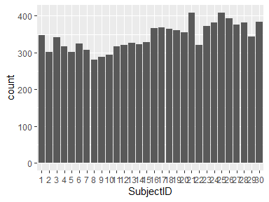

-   Observed factor levels: "1", "10", "11", "12", "13", "14", "15", "16", "17", "18", "19", "2", "20", "21", "22", "23", "24", "25", "26", "27", "28", "29", "3", "30", "4", "5", "6", "7", "8", "9".

ActivityLabel
-------------

*Activity type*

<table style="width:50%;">
<colgroup>
<col width="36%" />
<col width="13%" />
</colgroup>
<thead>
<tr class="header">
<th align="left">Feature</th>
<th align="right">Result</th>
</tr>
</thead>
<tbody>
<tr class="odd">
<td align="left">Variable type</td>
<td align="right">factor</td>
</tr>
<tr class="even">
<td align="left">Number of missing obs.</td>
<td align="right">0 (0 %)</td>
</tr>
<tr class="odd">
<td align="left">Number of unique values</td>
<td align="right">6</td>
</tr>
<tr class="even">
<td align="left">Mode</td>
<td align="right">&quot;Laying&quot;</td>
</tr>
<tr class="odd">
<td align="left">Reference category</td>
<td align="right">Laying</td>
</tr>
</tbody>
</table>

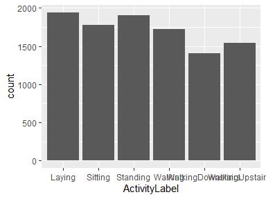

-   Observed factor levels: "Laying", "Sitting", "Standing", "Walking", "WalkingDownstairs", "WalkingUpstairs".

tBodyAccMeanX
-------------

*Mean of time domain measurement of body linear acceleration in X axis*

<table style="width:53%;">
<colgroup>
<col width="36%" />
<col width="16%" />
</colgroup>
<thead>
<tr class="header">
<th align="left">Feature</th>
<th align="right">Result</th>
</tr>
</thead>
<tbody>
<tr class="odd">
<td align="left">Variable type</td>
<td align="right">numeric</td>
</tr>
<tr class="even">
<td align="left">Number of missing obs.</td>
<td align="right">0 (0 %)</td>
</tr>
<tr class="odd">
<td align="left">Number of unique values</td>
<td align="right">10292</td>
</tr>
<tr class="even">
<td align="left">Median</td>
<td align="right">0.28</td>
</tr>
<tr class="odd">
<td align="left">1st and 3rd quartiles</td>
<td align="right">0.26; 0.29</td>
</tr>
<tr class="even">
<td align="left">Min. and max.</td>
<td align="right">-1; 1</td>
</tr>
</tbody>
</table>

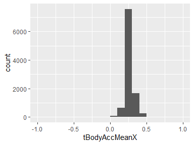

tBodyAccMeanY
-------------

*Mean of time domain measurement of body linear acceleration in Y axis*

<table style="width:56%;">
<colgroup>
<col width="36%" />
<col width="19%" />
</colgroup>
<thead>
<tr class="header">
<th align="left">Feature</th>
<th align="right">Result</th>
</tr>
</thead>
<tbody>
<tr class="odd">
<td align="left">Variable type</td>
<td align="right">numeric</td>
</tr>
<tr class="even">
<td align="left">Number of missing obs.</td>
<td align="right">0 (0 %)</td>
</tr>
<tr class="odd">
<td align="left">Number of unique values</td>
<td align="right">10299</td>
</tr>
<tr class="even">
<td align="left">Median</td>
<td align="right">-0.02</td>
</tr>
<tr class="odd">
<td align="left">1st and 3rd quartiles</td>
<td align="right">-0.02; -0.01</td>
</tr>
<tr class="even">
<td align="left">Min. and max.</td>
<td align="right">-1; 1</td>
</tr>
</tbody>
</table>

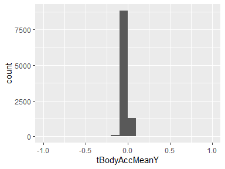

tBodyAccMeanZ
-------------

*Mean of time domain measurement of body linear acceleration in Z axis*

<table style="width:54%;">
<colgroup>
<col width="36%" />
<col width="18%" />
</colgroup>
<thead>
<tr class="header">
<th align="left">Feature</th>
<th align="right">Result</th>
</tr>
</thead>
<tbody>
<tr class="odd">
<td align="left">Variable type</td>
<td align="right">numeric</td>
</tr>
<tr class="even">
<td align="left">Number of missing obs.</td>
<td align="right">0 (0 %)</td>
</tr>
<tr class="odd">
<td align="left">Number of unique values</td>
<td align="right">10293</td>
</tr>
<tr class="even">
<td align="left">Median</td>
<td align="right">-0.11</td>
</tr>
<tr class="odd">
<td align="left">1st and 3rd quartiles</td>
<td align="right">-0.12; -0.1</td>
</tr>
<tr class="even">
<td align="left">Min. and max.</td>
<td align="right">-1; 1</td>
</tr>
</tbody>
</table>

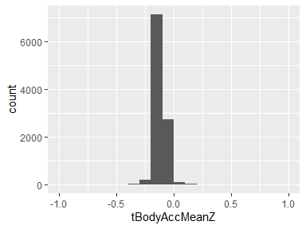

tBodyAccStdX
------------

*Standard deviation of time domain measurement of body linear acceleration in X axis*

<table style="width:56%;">
<colgroup>
<col width="36%" />
<col width="19%" />
</colgroup>
<thead>
<tr class="header">
<th align="left">Feature</th>
<th align="right">Result</th>
</tr>
</thead>
<tbody>
<tr class="odd">
<td align="left">Variable type</td>
<td align="right">numeric</td>
</tr>
<tr class="even">
<td align="left">Number of missing obs.</td>
<td align="right">0 (0 %)</td>
</tr>
<tr class="odd">
<td align="left">Number of unique values</td>
<td align="right">10295</td>
</tr>
<tr class="even">
<td align="left">Median</td>
<td align="right">-0.94</td>
</tr>
<tr class="odd">
<td align="left">1st and 3rd quartiles</td>
<td align="right">-0.99; -0.25</td>
</tr>
<tr class="even">
<td align="left">Min. and max.</td>
<td align="right">-1; 1</td>
</tr>
</tbody>
</table>

tBodyAccStdY
------------

*Standard deviation of time domain measurement of body linear acceleration in Y axis*

<table style="width:56%;">
<colgroup>
<col width="36%" />
<col width="19%" />
</colgroup>
<thead>
<tr class="header">
<th align="left">Feature</th>
<th align="right">Result</th>
</tr>
</thead>
<tbody>
<tr class="odd">
<td align="left">Variable type</td>
<td align="right">numeric</td>
</tr>
<tr class="even">
<td align="left">Number of missing obs.</td>
<td align="right">0 (0 %)</td>
</tr>
<tr class="odd">
<td align="left">Number of unique values</td>
<td align="right">10297</td>
</tr>
<tr class="even">
<td align="left">Median</td>
<td align="right">-0.84</td>
</tr>
<tr class="odd">
<td align="left">1st and 3rd quartiles</td>
<td align="right">-0.98; -0.06</td>
</tr>
<tr class="even">
<td align="left">Min. and max.</td>
<td align="right">-1; 1</td>
</tr>
</tbody>
</table>

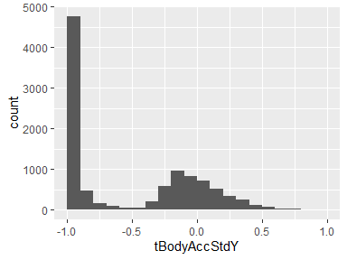

tBodyAccStdZ
------------

*Standard deviation of time domain measurement of body linear acceleration in Z axis*

<table style="width:56%;">
<colgroup>
<col width="36%" />
<col width="19%" />
</colgroup>
<thead>
<tr class="header">
<th align="left">Feature</th>
<th align="right">Result</th>
</tr>
</thead>
<tbody>
<tr class="odd">
<td align="left">Variable type</td>
<td align="right">numeric</td>
</tr>
<tr class="even">
<td align="left">Number of missing obs.</td>
<td align="right">0 (0 %)</td>
</tr>
<tr class="odd">
<td align="left">Number of unique values</td>
<td align="right">10297</td>
</tr>
<tr class="even">
<td align="left">Median</td>
<td align="right">-0.85</td>
</tr>
<tr class="odd">
<td align="left">1st and 3rd quartiles</td>
<td align="right">-0.98; -0.28</td>
</tr>
<tr class="even">
<td align="left">Min. and max.</td>
<td align="right">-1; 1</td>
</tr>
</tbody>
</table>

tGravityAccMeanX
----------------

*Mean of time domain measurement of gravity linear acceleration in X axis*

<table style="width:53%;">
<colgroup>
<col width="36%" />
<col width="16%" />
</colgroup>
<thead>
<tr class="header">
<th align="left">Feature</th>
<th align="right">Result</th>
</tr>
</thead>
<tbody>
<tr class="odd">
<td align="left">Variable type</td>
<td align="right">numeric</td>
</tr>
<tr class="even">
<td align="left">Number of missing obs.</td>
<td align="right">0 (0 %)</td>
</tr>
<tr class="odd">
<td align="left">Number of unique values</td>
<td align="right">10296</td>
</tr>
<tr class="even">
<td align="left">Median</td>
<td align="right">0.92</td>
</tr>
<tr class="odd">
<td align="left">1st and 3rd quartiles</td>
<td align="right">0.81; 0.95</td>
</tr>
<tr class="even">
<td align="left">Min. and max.</td>
<td align="right">-1; 1</td>
</tr>
</tbody>
</table>

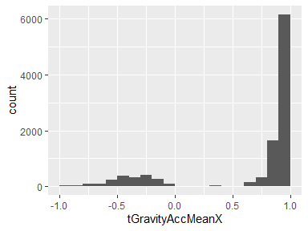

tGravityAccMeanY
----------------

*Mean of time domain measurement of gravity linear acceleration in Y axis*

<table style="width:54%;">
<colgroup>
<col width="36%" />
<col width="18%" />
</colgroup>
<thead>
<tr class="header">
<th align="left">Feature</th>
<th align="right">Result</th>
</tr>
</thead>
<tbody>
<tr class="odd">
<td align="left">Variable type</td>
<td align="right">numeric</td>
</tr>
<tr class="even">
<td align="left">Number of missing obs.</td>
<td align="right">0 (0 %)</td>
</tr>
<tr class="odd">
<td align="left">Number of unique values</td>
<td align="right">10298</td>
</tr>
<tr class="even">
<td align="left">Median</td>
<td align="right">-0.14</td>
</tr>
<tr class="odd">
<td align="left">1st and 3rd quartiles</td>
<td align="right">-0.24; 0.12</td>
</tr>
<tr class="even">
<td align="left">Min. and max.</td>
<td align="right">-1; 1</td>
</tr>
</tbody>
</table>

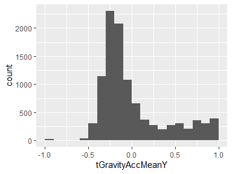

tGravityAccMeanZ
----------------

*Mean of time domain measurement of gravity linear acceleration in Z axis*

<table style="width:54%;">
<colgroup>
<col width="36%" />
<col width="18%" />
</colgroup>
<thead>
<tr class="header">
<th align="left">Feature</th>
<th align="right">Result</th>
</tr>
</thead>
<tbody>
<tr class="odd">
<td align="left">Variable type</td>
<td align="right">numeric</td>
</tr>
<tr class="even">
<td align="left">Number of missing obs.</td>
<td align="right">0 (0 %)</td>
</tr>
<tr class="odd">
<td align="left">Number of unique values</td>
<td align="right">10299</td>
</tr>
<tr class="even">
<td align="left">Median</td>
<td align="right">0.04</td>
</tr>
<tr class="odd">
<td align="left">1st and 3rd quartiles</td>
<td align="right">-0.12; 0.22</td>
</tr>
<tr class="even">
<td align="left">Min. and max.</td>
<td align="right">-1; 1</td>
</tr>
</tbody>
</table>

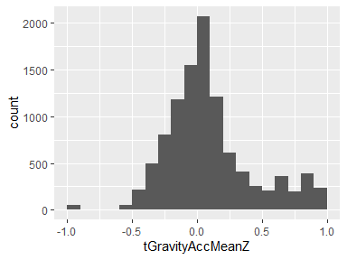

tGravityAccStdX
---------------

*Standard deviation of time domain measurement of gravity linear acceleration in X axis*

<table style="width:56%;">
<colgroup>
<col width="36%" />
<col width="19%" />
</colgroup>
<thead>
<tr class="header">
<th align="left">Feature</th>
<th align="right">Result</th>
</tr>
</thead>
<tbody>
<tr class="odd">
<td align="left">Variable type</td>
<td align="right">numeric</td>
</tr>
<tr class="even">
<td align="left">Number of missing obs.</td>
<td align="right">0 (0 %)</td>
</tr>
<tr class="odd">
<td align="left">Number of unique values</td>
<td align="right">10288</td>
</tr>
<tr class="even">
<td align="left">Median</td>
<td align="right">-0.98</td>
</tr>
<tr class="odd">
<td align="left">1st and 3rd quartiles</td>
<td align="right">-0.99; -0.96</td>
</tr>
<tr class="even">
<td align="left">Min. and max.</td>
<td align="right">-1; 1</td>
</tr>
</tbody>
</table>

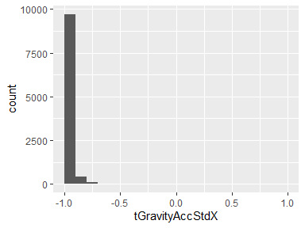

tGravityAccStdY
---------------

*Standard deviation of time domain measurement of gravity linear acceleration in Y axis*

<table style="width:56%;">
<colgroup>
<col width="36%" />
<col width="19%" />
</colgroup>
<thead>
<tr class="header">
<th align="left">Feature</th>
<th align="right">Result</th>
</tr>
</thead>
<tbody>
<tr class="odd">
<td align="left">Variable type</td>
<td align="right">numeric</td>
</tr>
<tr class="even">
<td align="left">Number of missing obs.</td>
<td align="right">0 (0 %)</td>
</tr>
<tr class="odd">
<td align="left">Number of unique values</td>
<td align="right">10293</td>
</tr>
<tr class="even">
<td align="left">Median</td>
<td align="right">-0.98</td>
</tr>
<tr class="odd">
<td align="left">1st and 3rd quartiles</td>
<td align="right">-0.99; -0.95</td>
</tr>
<tr class="even">
<td align="left">Min. and max.</td>
<td align="right">-1; 1</td>
</tr>
</tbody>
</table>

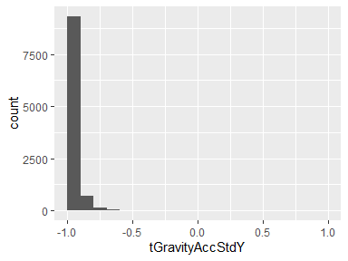

tGravityAccStdZ
---------------

*Standard deviation of time domain measurement of gravity linear acceleration in Z axis*

<table style="width:56%;">
<colgroup>
<col width="36%" />
<col width="19%" />
</colgroup>
<thead>
<tr class="header">
<th align="left">Feature</th>
<th align="right">Result</th>
</tr>
</thead>
<tbody>
<tr class="odd">
<td align="left">Variable type</td>
<td align="right">numeric</td>
</tr>
<tr class="even">
<td align="left">Number of missing obs.</td>
<td align="right">0 (0 %)</td>
</tr>
<tr class="odd">
<td align="left">Number of unique values</td>
<td align="right">10296</td>
</tr>
<tr class="even">
<td align="left">Median</td>
<td align="right">-0.97</td>
</tr>
<tr class="odd">
<td align="left">1st and 3rd quartiles</td>
<td align="right">-0.99; -0.93</td>
</tr>
<tr class="even">
<td align="left">Min. and max.</td>
<td align="right">-1; 1</td>
</tr>
</tbody>
</table>

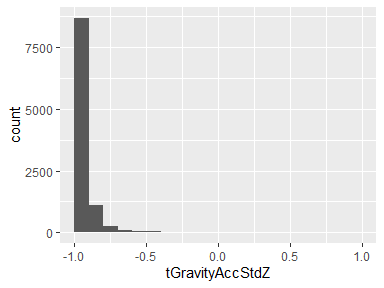

tBodyAccJerkMeanX
-----------------

*Mean of time domain measurement of body linear acceleration jerk signals in X axis*

<table style="width:53%;">
<colgroup>
<col width="36%" />
<col width="16%" />
</colgroup>
<thead>
<tr class="header">
<th align="left">Feature</th>
<th align="right">Result</th>
</tr>
</thead>
<tbody>
<tr class="odd">
<td align="left">Variable type</td>
<td align="right">numeric</td>
</tr>
<tr class="even">
<td align="left">Number of missing obs.</td>
<td align="right">0 (0 %)</td>
</tr>
<tr class="odd">
<td align="left">Number of unique values</td>
<td align="right">10299</td>
</tr>
<tr class="even">
<td align="left">Median</td>
<td align="right">0.08</td>
</tr>
<tr class="odd">
<td align="left">1st and 3rd quartiles</td>
<td align="right">0.06; 0.09</td>
</tr>
<tr class="even">
<td align="left">Min. and max.</td>
<td align="right">-1; 1</td>
</tr>
</tbody>
</table>

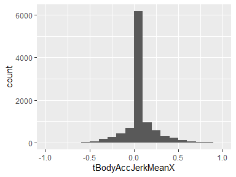

tBodyAccJerkMeanY
-----------------

*Mean of time domain measurement of body linear acceleration jerk signals in Y axis*

<table style="width:54%;">
<colgroup>
<col width="36%" />
<col width="18%" />
</colgroup>
<thead>
<tr class="header">
<th align="left">Feature</th>
<th align="right">Result</th>
</tr>
</thead>
<tbody>
<tr class="odd">
<td align="left">Variable type</td>
<td align="right">numeric</td>
</tr>
<tr class="even">
<td align="left">Number of missing obs.</td>
<td align="right">0 (0 %)</td>
</tr>
<tr class="odd">
<td align="left">Number of unique values</td>
<td align="right">10299</td>
</tr>
<tr class="even">
<td align="left">Median</td>
<td align="right">0.01</td>
</tr>
<tr class="odd">
<td align="left">1st and 3rd quartiles</td>
<td align="right">-0.02; 0.03</td>
</tr>
<tr class="even">
<td align="left">Min. and max.</td>
<td align="right">-1; 1</td>
</tr>
</tbody>
</table>

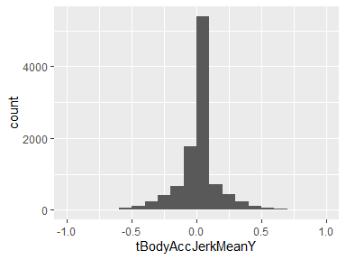

tBodyAccJerkMeanZ
-----------------

*Mean of time domain measurement of body linear acceleration jerk signals in Z axis*

<table style="width:54%;">
<colgroup>
<col width="36%" />
<col width="18%" />
</colgroup>
<thead>
<tr class="header">
<th align="left">Feature</th>
<th align="right">Result</th>
</tr>
</thead>
<tbody>
<tr class="odd">
<td align="left">Variable type</td>
<td align="right">numeric</td>
</tr>
<tr class="even">
<td align="left">Number of missing obs.</td>
<td align="right">0 (0 %)</td>
</tr>
<tr class="odd">
<td align="left">Number of unique values</td>
<td align="right">10299</td>
</tr>
<tr class="even">
<td align="left">Median</td>
<td align="right">0</td>
</tr>
<tr class="odd">
<td align="left">1st and 3rd quartiles</td>
<td align="right">-0.03; 0.02</td>
</tr>
<tr class="even">
<td align="left">Min. and max.</td>
<td align="right">-1; 1</td>
</tr>
</tbody>
</table>

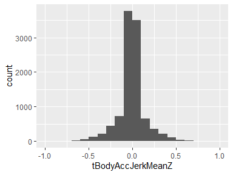

tBodyAccJerkStdX
----------------

*Standard deviation of time domain measurement of body linear acceleration jerk signals in X axis*

<table style="width:56%;">
<colgroup>
<col width="36%" />
<col width="19%" />
</colgroup>
<thead>
<tr class="header">
<th align="left">Feature</th>
<th align="right">Result</th>
</tr>
</thead>
<tbody>
<tr class="odd">
<td align="left">Variable type</td>
<td align="right">numeric</td>
</tr>
<tr class="even">
<td align="left">Number of missing obs.</td>
<td align="right">0 (0 %)</td>
</tr>
<tr class="odd">
<td align="left">Number of unique values</td>
<td align="right">10290</td>
</tr>
<tr class="even">
<td align="left">Median</td>
<td align="right">-0.95</td>
</tr>
<tr class="odd">
<td align="left">1st and 3rd quartiles</td>
<td align="right">-0.99; -0.29</td>
</tr>
<tr class="even">
<td align="left">Min. and max.</td>
<td align="right">-1; 1</td>
</tr>
</tbody>
</table>

tBodyAccJerkStdY
----------------

*Standard deviation of time domain measurement of body linear acceleration jerk signals in Y axis*

<table style="width:56%;">
<colgroup>
<col width="36%" />
<col width="19%" />
</colgroup>
<thead>
<tr class="header">
<th align="left">Feature</th>
<th align="right">Result</th>
</tr>
</thead>
<tbody>
<tr class="odd">
<td align="left">Variable type</td>
<td align="right">numeric</td>
</tr>
<tr class="even">
<td align="left">Number of missing obs.</td>
<td align="right">0 (0 %)</td>
</tr>
<tr class="odd">
<td align="left">Number of unique values</td>
<td align="right">10296</td>
</tr>
<tr class="even">
<td align="left">Median</td>
<td align="right">-0.93</td>
</tr>
<tr class="odd">
<td align="left">1st and 3rd quartiles</td>
<td align="right">-0.99; -0.22</td>
</tr>
<tr class="even">
<td align="left">Min. and max.</td>
<td align="right">-1; 1</td>
</tr>
</tbody>
</table>

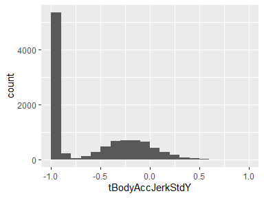

tBodyAccJerkStdZ
----------------

*Standard deviation of time domain measurement of body linear acceleration jerk signals in Z axis*

<table style="width:56%;">
<colgroup>
<col width="36%" />
<col width="19%" />
</colgroup>
<thead>
<tr class="header">
<th align="left">Feature</th>
<th align="right">Result</th>
</tr>
</thead>
<tbody>
<tr class="odd">
<td align="left">Variable type</td>
<td align="right">numeric</td>
</tr>
<tr class="even">
<td align="left">Number of missing obs.</td>
<td align="right">0 (0 %)</td>
</tr>
<tr class="odd">
<td align="left">Number of unique values</td>
<td align="right">10293</td>
</tr>
<tr class="even">
<td align="left">Median</td>
<td align="right">-0.95</td>
</tr>
<tr class="odd">
<td align="left">1st and 3rd quartiles</td>
<td align="right">-0.99; -0.55</td>
</tr>
<tr class="even">
<td align="left">Min. and max.</td>
<td align="right">-1; 1</td>
</tr>
</tbody>
</table>

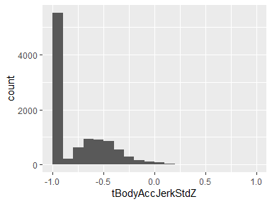

tBodyGyroMeanX
--------------

*Mean of time domain measurement of body angular velocity in X axis*

<table style="width:56%;">
<colgroup>
<col width="36%" />
<col width="19%" />
</colgroup>
<thead>
<tr class="header">
<th align="left">Feature</th>
<th align="right">Result</th>
</tr>
</thead>
<tbody>
<tr class="odd">
<td align="left">Variable type</td>
<td align="right">numeric</td>
</tr>
<tr class="even">
<td align="left">Number of missing obs.</td>
<td align="right">0 (0 %)</td>
</tr>
<tr class="odd">
<td align="left">Number of unique values</td>
<td align="right">10298</td>
</tr>
<tr class="even">
<td align="left">Median</td>
<td align="right">-0.03</td>
</tr>
<tr class="odd">
<td align="left">1st and 3rd quartiles</td>
<td align="right">-0.05; -0.01</td>
</tr>
<tr class="even">
<td align="left">Min. and max.</td>
<td align="right">-1; 1</td>
</tr>
</tbody>
</table>

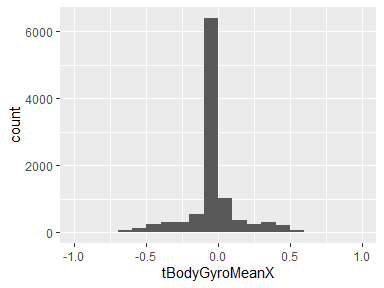

tBodyGyroMeanY
--------------

*Mean of time domain measurement of body angular velocity in Y axis*

<table style="width:54%;">
<colgroup>
<col width="36%" />
<col width="18%" />
</colgroup>
<thead>
<tr class="header">
<th align="left">Feature</th>
<th align="right">Result</th>
</tr>
</thead>
<tbody>
<tr class="odd">
<td align="left">Variable type</td>
<td align="right">numeric</td>
</tr>
<tr class="even">
<td align="left">Number of missing obs.</td>
<td align="right">0 (0 %)</td>
</tr>
<tr class="odd">
<td align="left">Number of unique values</td>
<td align="right">10299</td>
</tr>
<tr class="even">
<td align="left">Median</td>
<td align="right">-0.07</td>
</tr>
<tr class="odd">
<td align="left">1st and 3rd quartiles</td>
<td align="right">-0.1; -0.05</td>
</tr>
<tr class="even">
<td align="left">Min. and max.</td>
<td align="right">-1; 1</td>
</tr>
</tbody>
</table>

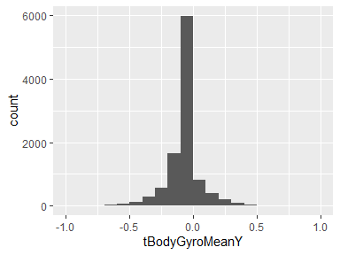

tBodyGyroMeanZ
--------------

*Mean of time domain measurement of body angular velocity in Z axis*

<table style="width:53%;">
<colgroup>
<col width="36%" />
<col width="16%" />
</colgroup>
<thead>
<tr class="header">
<th align="left">Feature</th>
<th align="right">Result</th>
</tr>
</thead>
<tbody>
<tr class="odd">
<td align="left">Variable type</td>
<td align="right">numeric</td>
</tr>
<tr class="even">
<td align="left">Number of missing obs.</td>
<td align="right">0 (0 %)</td>
</tr>
<tr class="odd">
<td align="left">Number of unique values</td>
<td align="right">10297</td>
</tr>
<tr class="even">
<td align="left">Median</td>
<td align="right">0.09</td>
</tr>
<tr class="odd">
<td align="left">1st and 3rd quartiles</td>
<td align="right">0.06; 0.11</td>
</tr>
<tr class="even">
<td align="left">Min. and max.</td>
<td align="right">-1; 1</td>
</tr>
</tbody>
</table>

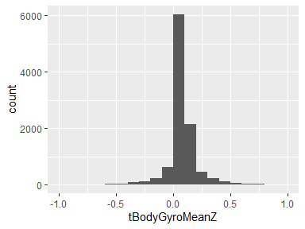

tBodyGyroStdX
-------------

*Standard deviation of time domain measurement of body angular velocity in X axis*

<table style="width:56%;">
<colgroup>
<col width="36%" />
<col width="19%" />
</colgroup>
<thead>
<tr class="header">
<th align="left">Feature</th>
<th align="right">Result</th>
</tr>
</thead>
<tbody>
<tr class="odd">
<td align="left">Variable type</td>
<td align="right">numeric</td>
</tr>
<tr class="even">
<td align="left">Number of missing obs.</td>
<td align="right">0 (0 %)</td>
</tr>
<tr class="odd">
<td align="left">Number of unique values</td>
<td align="right">10292</td>
</tr>
<tr class="even">
<td align="left">Median</td>
<td align="right">-0.9</td>
</tr>
<tr class="odd">
<td align="left">1st and 3rd quartiles</td>
<td align="right">-0.99; -0.48</td>
</tr>
<tr class="even">
<td align="left">Min. and max.</td>
<td align="right">-1; 1</td>
</tr>
</tbody>
</table>

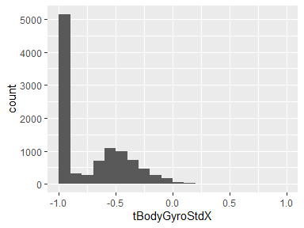

tBodyGyroStdY
-------------

*Standard deviation of time domain measurement of body angular velocity in Y axis*

<table style="width:56%;">
<colgroup>
<col width="36%" />
<col width="19%" />
</colgroup>
<thead>
<tr class="header">
<th align="left">Feature</th>
<th align="right">Result</th>
</tr>
</thead>
<tbody>
<tr class="odd">
<td align="left">Variable type</td>
<td align="right">numeric</td>
</tr>
<tr class="even">
<td align="left">Number of missing obs.</td>
<td align="right">0 (0 %)</td>
</tr>
<tr class="odd">
<td align="left">Number of unique values</td>
<td align="right">10296</td>
</tr>
<tr class="even">
<td align="left">Median</td>
<td align="right">-0.91</td>
</tr>
<tr class="odd">
<td align="left">1st and 3rd quartiles</td>
<td align="right">-0.98; -0.45</td>
</tr>
<tr class="even">
<td align="left">Min. and max.</td>
<td align="right">-1; 1</td>
</tr>
</tbody>
</table>

tBodyGyroStdZ
-------------

*Standard deviation of time domain measurement of body angular velocity in Z axis*

<table style="width:56%;">
<colgroup>
<col width="36%" />
<col width="19%" />
</colgroup>
<thead>
<tr class="header">
<th align="left">Feature</th>
<th align="right">Result</th>
</tr>
</thead>
<tbody>
<tr class="odd">
<td align="left">Variable type</td>
<td align="right">numeric</td>
</tr>
<tr class="even">
<td align="left">Number of missing obs.</td>
<td align="right">0 (0 %)</td>
</tr>
<tr class="odd">
<td align="left">Number of unique values</td>
<td align="right">10296</td>
</tr>
<tr class="even">
<td align="left">Median</td>
<td align="right">-0.88</td>
</tr>
<tr class="odd">
<td align="left">1st and 3rd quartiles</td>
<td align="right">-0.99; -0.34</td>
</tr>
<tr class="even">
<td align="left">Min. and max.</td>
<td align="right">-1; 1</td>
</tr>
</tbody>
</table>

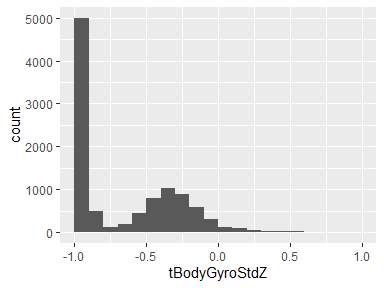

tBodyGyroJerkMeanX
------------------

*Mean of time domain measurement of body angular velocity jerk signals in X axis*

<table style="width:56%;">
<colgroup>
<col width="36%" />
<col width="19%" />
</colgroup>
<thead>
<tr class="header">
<th align="left">Feature</th>
<th align="right">Result</th>
</tr>
</thead>
<tbody>
<tr class="odd">
<td align="left">Variable type</td>
<td align="right">numeric</td>
</tr>
<tr class="even">
<td align="left">Number of missing obs.</td>
<td align="right">0 (0 %)</td>
</tr>
<tr class="odd">
<td align="left">Number of unique values</td>
<td align="right">10295</td>
</tr>
<tr class="even">
<td align="left">Median</td>
<td align="right">-0.1</td>
</tr>
<tr class="odd">
<td align="left">1st and 3rd quartiles</td>
<td align="right">-0.12; -0.08</td>
</tr>
<tr class="even">
<td align="left">Min. and max.</td>
<td align="right">-1; 1</td>
</tr>
</tbody>
</table>

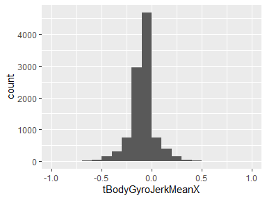

tBodyGyroJerkMeanY
------------------

*Mean of time domain measurement of body angular velocity jerk signals in Y axis*

<table style="width:56%;">
<colgroup>
<col width="36%" />
<col width="19%" />
</colgroup>
<thead>
<tr class="header">
<th align="left">Feature</th>
<th align="right">Result</th>
</tr>
</thead>
<tbody>
<tr class="odd">
<td align="left">Variable type</td>
<td align="right">numeric</td>
</tr>
<tr class="even">
<td align="left">Number of missing obs.</td>
<td align="right">0 (0 %)</td>
</tr>
<tr class="odd">
<td align="left">Number of unique values</td>
<td align="right">10299</td>
</tr>
<tr class="even">
<td align="left">Median</td>
<td align="right">-0.04</td>
</tr>
<tr class="odd">
<td align="left">1st and 3rd quartiles</td>
<td align="right">-0.06; -0.03</td>
</tr>
<tr class="even">
<td align="left">Min. and max.</td>
<td align="right">-1; 1</td>
</tr>
</tbody>
</table>

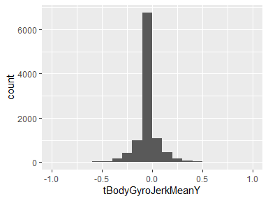

tBodyGyroJerkMeanZ
------------------

*Mean of time domain measurement of body angular velocity jerk signals in Z axis*

<table style="width:56%;">
<colgroup>
<col width="36%" />
<col width="19%" />
</colgroup>
<thead>
<tr class="header">
<th align="left">Feature</th>
<th align="right">Result</th>
</tr>
</thead>
<tbody>
<tr class="odd">
<td align="left">Variable type</td>
<td align="right">numeric</td>
</tr>
<tr class="even">
<td align="left">Number of missing obs.</td>
<td align="right">0 (0 %)</td>
</tr>
<tr class="odd">
<td align="left">Number of unique values</td>
<td align="right">10298</td>
</tr>
<tr class="even">
<td align="left">Median</td>
<td align="right">-0.05</td>
</tr>
<tr class="odd">
<td align="left">1st and 3rd quartiles</td>
<td align="right">-0.08; -0.03</td>
</tr>
<tr class="even">
<td align="left">Min. and max.</td>
<td align="right">-1; 1</td>
</tr>
</tbody>
</table>

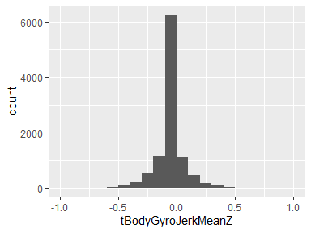

tBodyGyroJerkStdX
-----------------

*Standard deviation of time domain measurement of body angular velocity jerk signals in X axis*

<table style="width:56%;">
<colgroup>
<col width="36%" />
<col width="19%" />
</colgroup>
<thead>
<tr class="header">
<th align="left">Feature</th>
<th align="right">Result</th>
</tr>
</thead>
<tbody>
<tr class="odd">
<td align="left">Variable type</td>
<td align="right">numeric</td>
</tr>
<tr class="even">
<td align="left">Number of missing obs.</td>
<td align="right">0 (0 %)</td>
</tr>
<tr class="odd">
<td align="left">Number of unique values</td>
<td align="right">10292</td>
</tr>
<tr class="even">
<td align="left">Median</td>
<td align="right">-0.93</td>
</tr>
<tr class="odd">
<td align="left">1st and 3rd quartiles</td>
<td align="right">-0.99; -0.49</td>
</tr>
<tr class="even">
<td align="left">Min. and max.</td>
<td align="right">-1; 1</td>
</tr>
</tbody>
</table>

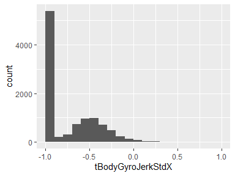

tBodyGyroJerkStdY
-----------------

*Standard deviation of time domain measurement of body angular velocity jerk signals in Y axis*

<table style="width:56%;">
<colgroup>
<col width="36%" />
<col width="19%" />
</colgroup>
<thead>
<tr class="header">
<th align="left">Feature</th>
<th align="right">Result</th>
</tr>
</thead>
<tbody>
<tr class="odd">
<td align="left">Variable type</td>
<td align="right">numeric</td>
</tr>
<tr class="even">
<td align="left">Number of missing obs.</td>
<td align="right">0 (0 %)</td>
</tr>
<tr class="odd">
<td align="left">Number of unique values</td>
<td align="right">10295</td>
</tr>
<tr class="even">
<td align="left">Median</td>
<td align="right">-0.95</td>
</tr>
<tr class="odd">
<td align="left">1st and 3rd quartiles</td>
<td align="right">-0.99; -0.63</td>
</tr>
<tr class="even">
<td align="left">Min. and max.</td>
<td align="right">-1; 1</td>
</tr>
</tbody>
</table>

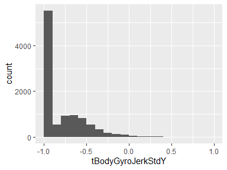

tBodyGyroJerkStdZ
-----------------

*Standard deviation of time domain measurement of body angular velocity jerk signals in Z axis*

<table style="width:56%;">
<colgroup>
<col width="36%" />
<col width="19%" />
</colgroup>
<thead>
<tr class="header">
<th align="left">Feature</th>
<th align="right">Result</th>
</tr>
</thead>
<tbody>
<tr class="odd">
<td align="left">Variable type</td>
<td align="right">numeric</td>
</tr>
<tr class="even">
<td align="left">Number of missing obs.</td>
<td align="right">0 (0 %)</td>
</tr>
<tr class="odd">
<td align="left">Number of unique values</td>
<td align="right">10291</td>
</tr>
<tr class="even">
<td align="left">Median</td>
<td align="right">-0.95</td>
</tr>
<tr class="odd">
<td align="left">1st and 3rd quartiles</td>
<td align="right">-0.99; -0.51</td>
</tr>
<tr class="even">
<td align="left">Min. and max.</td>
<td align="right">-1; 1</td>
</tr>
</tbody>
</table>

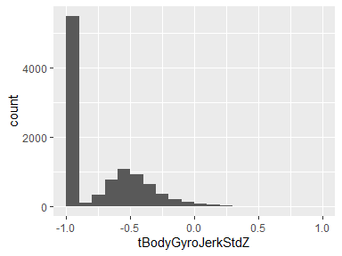

tBodyAccMagMean
---------------

*Mean of magnitide of time domain measurement of body linear acceleration*

<table style="width:56%;">
<colgroup>
<col width="36%" />
<col width="19%" />
</colgroup>
<thead>
<tr class="header">
<th align="left">Feature</th>
<th align="right">Result</th>
</tr>
</thead>
<tbody>
<tr class="odd">
<td align="left">Variable type</td>
<td align="right">numeric</td>
</tr>
<tr class="even">
<td align="left">Number of missing obs.</td>
<td align="right">0 (0 %)</td>
</tr>
<tr class="odd">
<td align="left">Number of unique values</td>
<td align="right">10296</td>
</tr>
<tr class="even">
<td align="left">Median</td>
<td align="right">-0.87</td>
</tr>
<tr class="odd">
<td align="left">1st and 3rd quartiles</td>
<td align="right">-0.98; -0.12</td>
</tr>
<tr class="even">
<td align="left">Min. and max.</td>
<td align="right">-1; 1</td>
</tr>
</tbody>
</table>

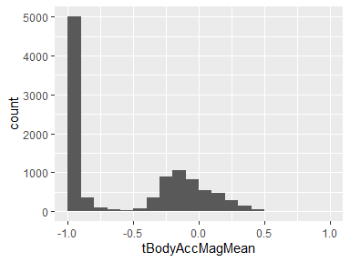

tBodyAccMagStd
--------------

*Standard deviation of magnitide of time domain measurement of body linear acceleration*

<table style="width:56%;">
<colgroup>
<col width="36%" />
<col width="19%" />
</colgroup>
<thead>
<tr class="header">
<th align="left">Feature</th>
<th align="right">Result</th>
</tr>
</thead>
<tbody>
<tr class="odd">
<td align="left">Variable type</td>
<td align="right">numeric</td>
</tr>
<tr class="even">
<td align="left">Number of missing obs.</td>
<td align="right">0 (0 %)</td>
</tr>
<tr class="odd">
<td align="left">Number of unique values</td>
<td align="right">10294</td>
</tr>
<tr class="even">
<td align="left">Median</td>
<td align="right">-0.84</td>
</tr>
<tr class="odd">
<td align="left">1st and 3rd quartiles</td>
<td align="right">-0.98; -0.24</td>
</tr>
<tr class="even">
<td align="left">Min. and max.</td>
<td align="right">-1; 1</td>
</tr>
</tbody>
</table>

tGravityAccMagMean
------------------

*Mean of magnitide of time domain measurement of gravity linear acceleration*

<table style="width:56%;">
<colgroup>
<col width="36%" />
<col width="19%" />
</colgroup>
<thead>
<tr class="header">
<th align="left">Feature</th>
<th align="right">Result</th>
</tr>
</thead>
<tbody>
<tr class="odd">
<td align="left">Variable type</td>
<td align="right">numeric</td>
</tr>
<tr class="even">
<td align="left">Number of missing obs.</td>
<td align="right">0 (0 %)</td>
</tr>
<tr class="odd">
<td align="left">Number of unique values</td>
<td align="right">10296</td>
</tr>
<tr class="even">
<td align="left">Median</td>
<td align="right">-0.87</td>
</tr>
<tr class="odd">
<td align="left">1st and 3rd quartiles</td>
<td align="right">-0.98; -0.12</td>
</tr>
<tr class="even">
<td align="left">Min. and max.</td>
<td align="right">-1; 1</td>
</tr>
</tbody>
</table>

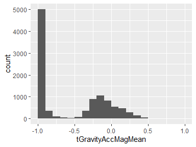

tGravityAccMagStd
-----------------

*Standard deviation of magnitide of time domain measurement of gravity linear acceleration*

<table style="width:56%;">
<colgroup>
<col width="36%" />
<col width="19%" />
</colgroup>
<thead>
<tr class="header">
<th align="left">Feature</th>
<th align="right">Result</th>
</tr>
</thead>
<tbody>
<tr class="odd">
<td align="left">Variable type</td>
<td align="right">numeric</td>
</tr>
<tr class="even">
<td align="left">Number of missing obs.</td>
<td align="right">0 (0 %)</td>
</tr>
<tr class="odd">
<td align="left">Number of unique values</td>
<td align="right">10294</td>
</tr>
<tr class="even">
<td align="left">Median</td>
<td align="right">-0.84</td>
</tr>
<tr class="odd">
<td align="left">1st and 3rd quartiles</td>
<td align="right">-0.98; -0.24</td>
</tr>
<tr class="even">
<td align="left">Min. and max.</td>
<td align="right">-1; 1</td>
</tr>
</tbody>
</table>

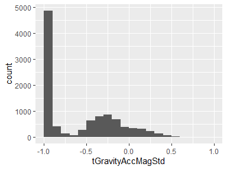

tBodyAccJerkMagMean
-------------------

*Mean of magnitide of time domain measurement of body linear acceleration jerk signals*

<table style="width:54%;">
<colgroup>
<col width="36%" />
<col width="18%" />
</colgroup>
<thead>
<tr class="header">
<th align="left">Feature</th>
<th align="right">Result</th>
</tr>
</thead>
<tbody>
<tr class="odd">
<td align="left">Variable type</td>
<td align="right">numeric</td>
</tr>
<tr class="even">
<td align="left">Number of missing obs.</td>
<td align="right">0 (0 %)</td>
</tr>
<tr class="odd">
<td align="left">Number of unique values</td>
<td align="right">10292</td>
</tr>
<tr class="even">
<td align="left">Median</td>
<td align="right">-0.95</td>
</tr>
<tr class="odd">
<td align="left">1st and 3rd quartiles</td>
<td align="right">-0.99; -0.3</td>
</tr>
<tr class="even">
<td align="left">Min. and max.</td>
<td align="right">-1; 1</td>
</tr>
</tbody>
</table>

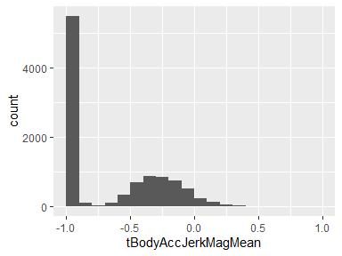

tBodyAccJerkMagStd
------------------

*Standard deviation of magnitide of time domain measurement of body linear acceleration jerk signals*

<table style="width:56%;">
<colgroup>
<col width="36%" />
<col width="19%" />
</colgroup>
<thead>
<tr class="header">
<th align="left">Feature</th>
<th align="right">Result</th>
</tr>
</thead>
<tbody>
<tr class="odd">
<td align="left">Variable type</td>
<td align="right">numeric</td>
</tr>
<tr class="even">
<td align="left">Number of missing obs.</td>
<td align="right">0 (0 %)</td>
</tr>
<tr class="odd">
<td align="left">Number of unique values</td>
<td align="right">10294</td>
</tr>
<tr class="even">
<td align="left">Median</td>
<td align="right">-0.93</td>
</tr>
<tr class="odd">
<td align="left">1st and 3rd quartiles</td>
<td align="right">-0.99; -0.27</td>
</tr>
<tr class="even">
<td align="left">Min. and max.</td>
<td align="right">-1; 1</td>
</tr>
</tbody>
</table>

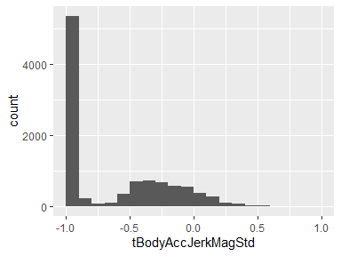

tBodyGyroMagMean
----------------

*Mean of magnitide of time domain measurement of body angular velocity*

<table style="width:56%;">
<colgroup>
<col width="36%" />
<col width="19%" />
</colgroup>
<thead>
<tr class="header">
<th align="left">Feature</th>
<th align="right">Result</th>
</tr>
</thead>
<tbody>
<tr class="odd">
<td align="left">Variable type</td>
<td align="right">numeric</td>
</tr>
<tr class="even">
<td align="left">Number of missing obs.</td>
<td align="right">0 (0 %)</td>
</tr>
<tr class="odd">
<td align="left">Number of unique values</td>
<td align="right">10298</td>
</tr>
<tr class="even">
<td align="left">Median</td>
<td align="right">-0.82</td>
</tr>
<tr class="odd">
<td align="left">1st and 3rd quartiles</td>
<td align="right">-0.98; -0.25</td>
</tr>
<tr class="even">
<td align="left">Min. and max.</td>
<td align="right">-1; 1</td>
</tr>
</tbody>
</table>

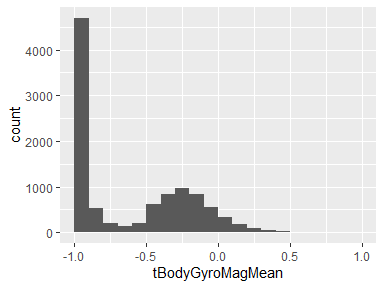

tBodyGyroMagStd
---------------

*Standard deviation of magnitide of time domain measurement of body angular velocity*

<table style="width:56%;">
<colgroup>
<col width="36%" />
<col width="19%" />
</colgroup>
<thead>
<tr class="header">
<th align="left">Feature</th>
<th align="right">Result</th>
</tr>
</thead>
<tbody>
<tr class="odd">
<td align="left">Variable type</td>
<td align="right">numeric</td>
</tr>
<tr class="even">
<td align="left">Number of missing obs.</td>
<td align="right">0 (0 %)</td>
</tr>
<tr class="odd">
<td align="left">Number of unique values</td>
<td align="right">10298</td>
</tr>
<tr class="even">
<td align="left">Median</td>
<td align="right">-0.83</td>
</tr>
<tr class="odd">
<td align="left">1st and 3rd quartiles</td>
<td align="right">-0.98; -0.39</td>
</tr>
<tr class="even">
<td align="left">Min. and max.</td>
<td align="right">-1; 1</td>
</tr>
</tbody>
</table>

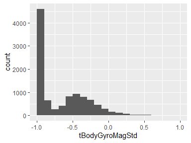

tBodyGyroJerkMagMean
--------------------

*Mean of magnitide of time domain measurement of body angular velocity jerk signals*

<table style="width:56%;">
<colgroup>
<col width="36%" />
<col width="19%" />
</colgroup>
<thead>
<tr class="header">
<th align="left">Feature</th>
<th align="right">Result</th>
</tr>
</thead>
<tbody>
<tr class="odd">
<td align="left">Variable type</td>
<td align="right">numeric</td>
</tr>
<tr class="even">
<td align="left">Number of missing obs.</td>
<td align="right">0 (0 %)</td>
</tr>
<tr class="odd">
<td align="left">Number of unique values</td>
<td align="right">10293</td>
</tr>
<tr class="even">
<td align="left">Median</td>
<td align="right">-0.96</td>
</tr>
<tr class="odd">
<td align="left">1st and 3rd quartiles</td>
<td align="right">-0.99; -0.55</td>
</tr>
<tr class="even">
<td align="left">Min. and max.</td>
<td align="right">-1; 1</td>
</tr>
</tbody>
</table>

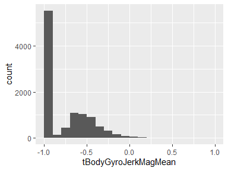

tBodyGyroJerkMagStd
-------------------

*Standard deviation of magnitide of time domain measurement of body angular velocity jerk signals*

<table style="width:56%;">
<colgroup>
<col width="36%" />
<col width="19%" />
</colgroup>
<thead>
<tr class="header">
<th align="left">Feature</th>
<th align="right">Result</th>
</tr>
</thead>
<tbody>
<tr class="odd">
<td align="left">Variable type</td>
<td align="right">numeric</td>
</tr>
<tr class="even">
<td align="left">Number of missing obs.</td>
<td align="right">0 (0 %)</td>
</tr>
<tr class="odd">
<td align="left">Number of unique values</td>
<td align="right">10297</td>
</tr>
<tr class="even">
<td align="left">Median</td>
<td align="right">-0.94</td>
</tr>
<tr class="odd">
<td align="left">1st and 3rd quartiles</td>
<td align="right">-0.99; -0.61</td>
</tr>
<tr class="even">
<td align="left">Min. and max.</td>
<td align="right">-1; 1</td>
</tr>
</tbody>
</table>

fBodyAccMeanX
-------------

*Mean of frequency domain measurement of body linear acceleration in X axis*

<table style="width:56%;">
<colgroup>
<col width="36%" />
<col width="19%" />
</colgroup>
<thead>
<tr class="header">
<th align="left">Feature</th>
<th align="right">Result</th>
</tr>
</thead>
<tbody>
<tr class="odd">
<td align="left">Variable type</td>
<td align="right">numeric</td>
</tr>
<tr class="even">
<td align="left">Number of missing obs.</td>
<td align="right">0 (0 %)</td>
</tr>
<tr class="odd">
<td align="left">Number of unique values</td>
<td align="right">10295</td>
</tr>
<tr class="even">
<td align="left">Median</td>
<td align="right">-0.95</td>
</tr>
<tr class="odd">
<td align="left">1st and 3rd quartiles</td>
<td align="right">-0.99; -0.26</td>
</tr>
<tr class="even">
<td align="left">Min. and max.</td>
<td align="right">-1; 1</td>
</tr>
</tbody>
</table>

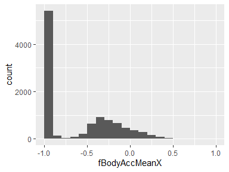

fBodyAccMeanY
-------------

*Mean of frequency domain measurement of body linear acceleration in Y axis*

<table style="width:54%;">
<colgroup>
<col width="36%" />
<col width="18%" />
</colgroup>
<thead>
<tr class="header">
<th align="left">Feature</th>
<th align="right">Result</th>
</tr>
</thead>
<tbody>
<tr class="odd">
<td align="left">Variable type</td>
<td align="right">numeric</td>
</tr>
<tr class="even">
<td align="left">Number of missing obs.</td>
<td align="right">0 (0 %)</td>
</tr>
<tr class="odd">
<td align="left">Number of unique values</td>
<td align="right">10292</td>
</tr>
<tr class="even">
<td align="left">Median</td>
<td align="right">-0.86</td>
</tr>
<tr class="odd">
<td align="left">1st and 3rd quartiles</td>
<td align="right">-0.98; -0.1</td>
</tr>
<tr class="even">
<td align="left">Min. and max.</td>
<td align="right">-1; 1</td>
</tr>
</tbody>
</table>

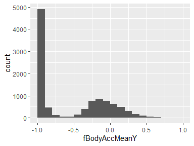

fBodyAccMeanZ
-------------

*Mean of frequency domain measurement of body linear acceleration in Z axis*

<table style="width:56%;">
<colgroup>
<col width="36%" />
<col width="19%" />
</colgroup>
<thead>
<tr class="header">
<th align="left">Feature</th>
<th align="right">Result</th>
</tr>
</thead>
<tbody>
<tr class="odd">
<td align="left">Variable type</td>
<td align="right">numeric</td>
</tr>
<tr class="even">
<td align="left">Number of missing obs.</td>
<td align="right">0 (0 %)</td>
</tr>
<tr class="odd">
<td align="left">Number of unique values</td>
<td align="right">10295</td>
</tr>
<tr class="even">
<td align="left">Median</td>
<td align="right">-0.9</td>
</tr>
<tr class="odd">
<td align="left">1st and 3rd quartiles</td>
<td align="right">-0.98; -0.37</td>
</tr>
<tr class="even">
<td align="left">Min. and max.</td>
<td align="right">-1; 1</td>
</tr>
</tbody>
</table>

fBodyAccStdX
------------

*Standard deviation of frequency domain measurement of body linear acceleration in X axis*

<table style="width:56%;">
<colgroup>
<col width="36%" />
<col width="19%" />
</colgroup>
<thead>
<tr class="header">
<th align="left">Feature</th>
<th align="right">Result</th>
</tr>
</thead>
<tbody>
<tr class="odd">
<td align="left">Variable type</td>
<td align="right">numeric</td>
</tr>
<tr class="even">
<td align="left">Number of missing obs.</td>
<td align="right">0 (0 %)</td>
</tr>
<tr class="odd">
<td align="left">Number of unique values</td>
<td align="right">10294</td>
</tr>
<tr class="even">
<td align="left">Median</td>
<td align="right">-0.94</td>
</tr>
<tr class="odd">
<td align="left">1st and 3rd quartiles</td>
<td align="right">-0.99; -0.25</td>
</tr>
<tr class="even">
<td align="left">Min. and max.</td>
<td align="right">-1; 1</td>
</tr>
</tbody>
</table>

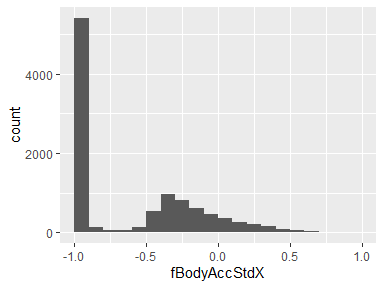

fBodyAccStdY
------------

*Standard deviation of frequency domain measurement of body linear acceleration in Y axis*

<table style="width:56%;">
<colgroup>
<col width="36%" />
<col width="19%" />
</colgroup>
<thead>
<tr class="header">
<th align="left">Feature</th>
<th align="right">Result</th>
</tr>
</thead>
<tbody>
<tr class="odd">
<td align="left">Variable type</td>
<td align="right">numeric</td>
</tr>
<tr class="even">
<td align="left">Number of missing obs.</td>
<td align="right">0 (0 %)</td>
</tr>
<tr class="odd">
<td align="left">Number of unique values</td>
<td align="right">10297</td>
</tr>
<tr class="even">
<td align="left">Median</td>
<td align="right">-0.83</td>
</tr>
<tr class="odd">
<td align="left">1st and 3rd quartiles</td>
<td align="right">-0.98; -0.09</td>
</tr>
<tr class="even">
<td align="left">Min. and max.</td>
<td align="right">-1; 1</td>
</tr>
</tbody>
</table>

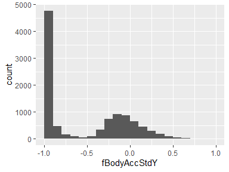

fBodyAccStdZ
------------

*Standard deviation of frequency domain measurement of body linear acceleration in Z axis*

<table style="width:54%;">
<colgroup>
<col width="36%" />
<col width="18%" />
</colgroup>
<thead>
<tr class="header">
<th align="left">Feature</th>
<th align="right">Result</th>
</tr>
</thead>
<tbody>
<tr class="odd">
<td align="left">Variable type</td>
<td align="right">numeric</td>
</tr>
<tr class="even">
<td align="left">Number of missing obs.</td>
<td align="right">0 (0 %)</td>
</tr>
<tr class="odd">
<td align="left">Number of unique values</td>
<td align="right">10296</td>
</tr>
<tr class="even">
<td align="left">Median</td>
<td align="right">-0.84</td>
</tr>
<tr class="odd">
<td align="left">1st and 3rd quartiles</td>
<td align="right">-0.98; -0.3</td>
</tr>
<tr class="even">
<td align="left">Min. and max.</td>
<td align="right">-1; 1</td>
</tr>
</tbody>
</table>

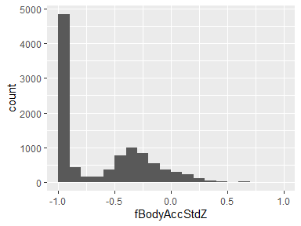

fBodyAccJerkMeanX
-----------------

*Mean of frequency domain measurement of body linear acceleration jerk signals in X axis*

<table style="width:56%;">
<colgroup>
<col width="36%" />
<col width="19%" />
</colgroup>
<thead>
<tr class="header">
<th align="left">Feature</th>
<th align="right">Result</th>
</tr>
</thead>
<tbody>
<tr class="odd">
<td align="left">Variable type</td>
<td align="right">numeric</td>
</tr>
<tr class="even">
<td align="left">Number of missing obs.</td>
<td align="right">0 (0 %)</td>
</tr>
<tr class="odd">
<td align="left">Number of unique values</td>
<td align="right">10293</td>
</tr>
<tr class="even">
<td align="left">Median</td>
<td align="right">-0.95</td>
</tr>
<tr class="odd">
<td align="left">1st and 3rd quartiles</td>
<td align="right">-0.99; -0.33</td>
</tr>
<tr class="even">
<td align="left">Min. and max.</td>
<td align="right">-1; 1</td>
</tr>
</tbody>
</table>

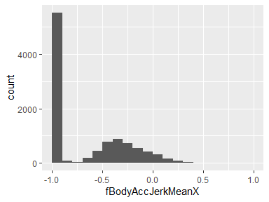

fBodyAccJerkMeanY
-----------------

*Mean of frequency domain measurement of body linear acceleration jerk signals in Y axis*

<table style="width:56%;">
<colgroup>
<col width="36%" />
<col width="19%" />
</colgroup>
<thead>
<tr class="header">
<th align="left">Feature</th>
<th align="right">Result</th>
</tr>
</thead>
<tbody>
<tr class="odd">
<td align="left">Variable type</td>
<td align="right">numeric</td>
</tr>
<tr class="even">
<td align="left">Number of missing obs.</td>
<td align="right">0 (0 %)</td>
</tr>
<tr class="odd">
<td align="left">Number of unique values</td>
<td align="right">10296</td>
</tr>
<tr class="even">
<td align="left">Median</td>
<td align="right">-0.93</td>
</tr>
<tr class="odd">
<td align="left">1st and 3rd quartiles</td>
<td align="right">-0.98; -0.26</td>
</tr>
<tr class="even">
<td align="left">Min. and max.</td>
<td align="right">-1; 1</td>
</tr>
</tbody>
</table>

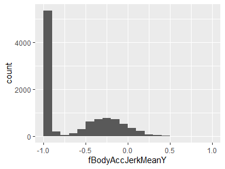

fBodyAccJerkMeanZ
-----------------

*Mean of frequency domain measurement of body linear acceleration jerk signals in Z axis*

<table style="width:56%;">
<colgroup>
<col width="36%" />
<col width="19%" />
</colgroup>
<thead>
<tr class="header">
<th align="left">Feature</th>
<th align="right">Result</th>
</tr>
</thead>
<tbody>
<tr class="odd">
<td align="left">Variable type</td>
<td align="right">numeric</td>
</tr>
<tr class="even">
<td align="left">Number of missing obs.</td>
<td align="right">0 (0 %)</td>
</tr>
<tr class="odd">
<td align="left">Number of unique values</td>
<td align="right">10294</td>
</tr>
<tr class="even">
<td align="left">Median</td>
<td align="right">-0.95</td>
</tr>
<tr class="odd">
<td align="left">1st and 3rd quartiles</td>
<td align="right">-0.99; -0.51</td>
</tr>
<tr class="even">
<td align="left">Min. and max.</td>
<td align="right">-1; 1</td>
</tr>
</tbody>
</table>

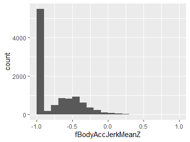

fBodyAccJerkStdX
----------------

*Standard deviation of frequency domain measurement of body linear acceleration jerk signals in X axis*

<table style="width:56%;">
<colgroup>
<col width="36%" />
<col width="19%" />
</colgroup>
<thead>
<tr class="header">
<th align="left">Feature</th>
<th align="right">Result</th>
</tr>
</thead>
<tbody>
<tr class="odd">
<td align="left">Variable type</td>
<td align="right">numeric</td>
</tr>
<tr class="even">
<td align="left">Number of missing obs.</td>
<td align="right">0 (0 %)</td>
</tr>
<tr class="odd">
<td align="left">Number of unique values</td>
<td align="right">10291</td>
</tr>
<tr class="even">
<td align="left">Median</td>
<td align="right">-0.96</td>
</tr>
<tr class="odd">
<td align="left">1st and 3rd quartiles</td>
<td align="right">-0.99; -0.32</td>
</tr>
<tr class="even">
<td align="left">Min. and max.</td>
<td align="right">-1; 1</td>
</tr>
</tbody>
</table>

fBodyAccJerkStdY
----------------

*Standard deviation of frequency domain measurement of body linear acceleration jerk signals in Y axis*

<table style="width:56%;">
<colgroup>
<col width="36%" />
<col width="19%" />
</colgroup>
<thead>
<tr class="header">
<th align="left">Feature</th>
<th align="right">Result</th>
</tr>
</thead>
<tbody>
<tr class="odd">
<td align="left">Variable type</td>
<td align="right">numeric</td>
</tr>
<tr class="even">
<td align="left">Number of missing obs.</td>
<td align="right">0 (0 %)</td>
</tr>
<tr class="odd">
<td align="left">Number of unique values</td>
<td align="right">10294</td>
</tr>
<tr class="even">
<td align="left">Median</td>
<td align="right">-0.93</td>
</tr>
<tr class="odd">
<td align="left">1st and 3rd quartiles</td>
<td align="right">-0.99; -0.24</td>
</tr>
<tr class="even">
<td align="left">Min. and max.</td>
<td align="right">-1; 1</td>
</tr>
</tbody>
</table>

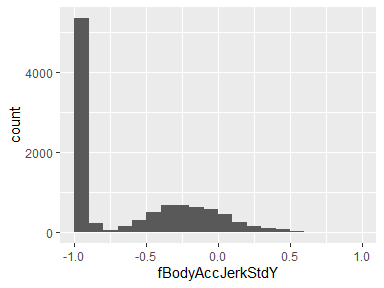

fBodyAccJerkStdZ
----------------

*Standard deviation of frequency domain measurement of body linear acceleration jerk signals in Z axis*

<table style="width:56%;">
<colgroup>
<col width="36%" />
<col width="19%" />
</colgroup>
<thead>
<tr class="header">
<th align="left">Feature</th>
<th align="right">Result</th>
</tr>
</thead>
<tbody>
<tr class="odd">
<td align="left">Variable type</td>
<td align="right">numeric</td>
</tr>
<tr class="even">
<td align="left">Number of missing obs.</td>
<td align="right">0 (0 %)</td>
</tr>
<tr class="odd">
<td align="left">Number of unique values</td>
<td align="right">10290</td>
</tr>
<tr class="even">
<td align="left">Median</td>
<td align="right">-0.96</td>
</tr>
<tr class="odd">
<td align="left">1st and 3rd quartiles</td>
<td align="right">-0.99; -0.59</td>
</tr>
<tr class="even">
<td align="left">Min. and max.</td>
<td align="right">-1; 1</td>
</tr>
</tbody>
</table>

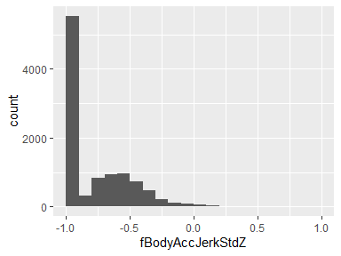

fBodyGyroMeanX
--------------

*Mean of frequency domain measurement of body angular velocity in X axis*

<table style="width:56%;">
<colgroup>
<col width="36%" />
<col width="19%" />
</colgroup>
<thead>
<tr class="header">
<th align="left">Feature</th>
<th align="right">Result</th>
</tr>
</thead>
<tbody>
<tr class="odd">
<td align="left">Variable type</td>
<td align="right">numeric</td>
</tr>
<tr class="even">
<td align="left">Number of missing obs.</td>
<td align="right">0 (0 %)</td>
</tr>
<tr class="odd">
<td align="left">Number of unique values</td>
<td align="right">10297</td>
</tr>
<tr class="even">
<td align="left">Median</td>
<td align="right">-0.89</td>
</tr>
<tr class="odd">
<td align="left">1st and 3rd quartiles</td>
<td align="right">-0.99; -0.38</td>
</tr>
<tr class="even">
<td align="left">Min. and max.</td>
<td align="right">-1; 1</td>
</tr>
</tbody>
</table>

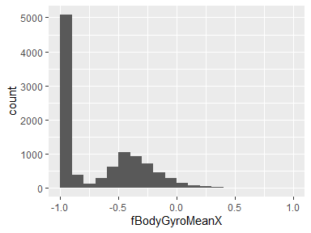

fBodyGyroMeanY
--------------

*Mean of frequency domain measurement of body angular velocity in Y axis*

<table style="width:56%;">
<colgroup>
<col width="36%" />
<col width="19%" />
</colgroup>
<thead>
<tr class="header">
<th align="left">Feature</th>
<th align="right">Result</th>
</tr>
</thead>
<tbody>
<tr class="odd">
<td align="left">Variable type</td>
<td align="right">numeric</td>
</tr>
<tr class="even">
<td align="left">Number of missing obs.</td>
<td align="right">0 (0 %)</td>
</tr>
<tr class="odd">
<td align="left">Number of unique values</td>
<td align="right">10296</td>
</tr>
<tr class="even">
<td align="left">Median</td>
<td align="right">-0.92</td>
</tr>
<tr class="odd">
<td align="left">1st and 3rd quartiles</td>
<td align="right">-0.98; -0.47</td>
</tr>
<tr class="even">
<td align="left">Min. and max.</td>
<td align="right">-1; 1</td>
</tr>
</tbody>
</table>

fBodyGyroMeanZ
--------------

*Mean of frequency domain measurement of body angular velocity in Z axis*

<table style="width:56%;">
<colgroup>
<col width="36%" />
<col width="19%" />
</colgroup>
<thead>
<tr class="header">
<th align="left">Feature</th>
<th align="right">Result</th>
</tr>
</thead>
<tbody>
<tr class="odd">
<td align="left">Variable type</td>
<td align="right">numeric</td>
</tr>
<tr class="even">
<td align="left">Number of missing obs.</td>
<td align="right">0 (0 %)</td>
</tr>
<tr class="odd">
<td align="left">Number of unique values</td>
<td align="right">10297</td>
</tr>
<tr class="even">
<td align="left">Median</td>
<td align="right">-0.89</td>
</tr>
<tr class="odd">
<td align="left">1st and 3rd quartiles</td>
<td align="right">-0.99; -0.32</td>
</tr>
<tr class="even">
<td align="left">Min. and max.</td>
<td align="right">-1; 1</td>
</tr>
</tbody>
</table>

fBodyGyroStdX
-------------

*Standard deviation of frequency domain measurement of body angular velocity in X axis*

<table style="width:56%;">
<colgroup>
<col width="36%" />
<col width="19%" />
</colgroup>
<thead>
<tr class="header">
<th align="left">Feature</th>
<th align="right">Result</th>
</tr>
</thead>
<tbody>
<tr class="odd">
<td align="left">Variable type</td>
<td align="right">numeric</td>
</tr>
<tr class="even">
<td align="left">Number of missing obs.</td>
<td align="right">0 (0 %)</td>
</tr>
<tr class="odd">
<td align="left">Number of unique values</td>
<td align="right">10297</td>
</tr>
<tr class="even">
<td align="left">Median</td>
<td align="right">-0.91</td>
</tr>
<tr class="odd">
<td align="left">1st and 3rd quartiles</td>
<td align="right">-0.99; -0.52</td>
</tr>
<tr class="even">
<td align="left">Min. and max.</td>
<td align="right">-1; 1</td>
</tr>
</tbody>
</table>

fBodyGyroStdY
-------------

*Standard deviation of frequency domain measurement of body angular velocity in Y axis*

<table style="width:56%;">
<colgroup>
<col width="36%" />
<col width="19%" />
</colgroup>
<thead>
<tr class="header">
<th align="left">Feature</th>
<th align="right">Result</th>
</tr>
</thead>
<tbody>
<tr class="odd">
<td align="left">Variable type</td>
<td align="right">numeric</td>
</tr>
<tr class="even">
<td align="left">Number of missing obs.</td>
<td align="right">0 (0 %)</td>
</tr>
<tr class="odd">
<td align="left">Number of unique values</td>
<td align="right">10293</td>
</tr>
<tr class="even">
<td align="left">Median</td>
<td align="right">-0.91</td>
</tr>
<tr class="odd">
<td align="left">1st and 3rd quartiles</td>
<td align="right">-0.98; -0.44</td>
</tr>
<tr class="even">
<td align="left">Min. and max.</td>
<td align="right">-1; 1</td>
</tr>
</tbody>
</table>

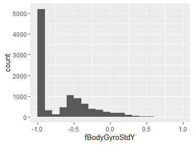

fBodyGyroStdZ
-------------

*Standard deviation of frequency domain measurement of body angular velocity in Z axis*

<table style="width:56%;">
<colgroup>
<col width="36%" />
<col width="19%" />
</colgroup>
<thead>
<tr class="header">
<th align="left">Feature</th>
<th align="right">Result</th>
</tr>
</thead>
<tbody>
<tr class="odd">
<td align="left">Variable type</td>
<td align="right">numeric</td>
</tr>
<tr class="even">
<td align="left">Number of missing obs.</td>
<td align="right">0 (0 %)</td>
</tr>
<tr class="odd">
<td align="left">Number of unique values</td>
<td align="right">10295</td>
</tr>
<tr class="even">
<td align="left">Median</td>
<td align="right">-0.89</td>
</tr>
<tr class="odd">
<td align="left">1st and 3rd quartiles</td>
<td align="right">-0.99; -0.42</td>
</tr>
<tr class="even">
<td align="left">Min. and max.</td>
<td align="right">-1; 1</td>
</tr>
</tbody>
</table>

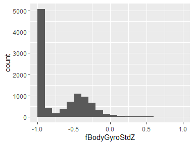

fBodyAccMagMean
---------------

*Mean of magnitide of frequency domain measurement of body linear acceleration*

<table style="width:56%;">
<colgroup>
<col width="36%" />
<col width="19%" />
</colgroup>
<thead>
<tr class="header">
<th align="left">Feature</th>
<th align="right">Result</th>
</tr>
</thead>
<tbody>
<tr class="odd">
<td align="left">Variable type</td>
<td align="right">numeric</td>
</tr>
<tr class="even">
<td align="left">Number of missing obs.</td>
<td align="right">0 (0 %)</td>
</tr>
<tr class="odd">
<td align="left">Number of unique values</td>
<td align="right">10296</td>
</tr>
<tr class="even">
<td align="left">Median</td>
<td align="right">-0.88</td>
</tr>
<tr class="odd">
<td align="left">1st and 3rd quartiles</td>
<td align="right">-0.98; -0.22</td>
</tr>
<tr class="even">
<td align="left">Min. and max.</td>
<td align="right">-1; 1</td>
</tr>
</tbody>
</table>

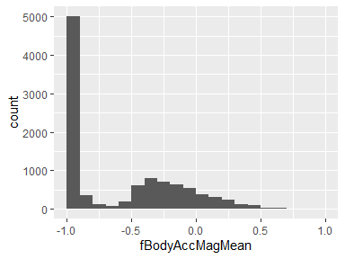

fBodyAccMagStd
--------------

*Standard deviation of magnitide of frequency domain measurement of body linear acceleration*

<table style="width:56%;">
<colgroup>
<col width="36%" />
<col width="19%" />
</colgroup>
<thead>
<tr class="header">
<th align="left">Feature</th>
<th align="right">Result</th>
</tr>
</thead>
<tbody>
<tr class="odd">
<td align="left">Variable type</td>
<td align="right">numeric</td>
</tr>
<tr class="even">
<td align="left">Number of missing obs.</td>
<td align="right">0 (0 %)</td>
</tr>
<tr class="odd">
<td align="left">Number of unique values</td>
<td align="right">10298</td>
</tr>
<tr class="even">
<td align="left">Median</td>
<td align="right">-0.85</td>
</tr>
<tr class="odd">
<td align="left">1st and 3rd quartiles</td>
<td align="right">-0.98; -0.38</td>
</tr>
<tr class="even">
<td align="left">Min. and max.</td>
<td align="right">-1; 1</td>
</tr>
</tbody>
</table>

fBodyBodyAccJerkMagMean
-----------------------

*Mean of magnitide of frequency domain measurement of body linear acceleration jerk signals*

<table style="width:56%;">
<colgroup>
<col width="36%" />
<col width="19%" />
</colgroup>
<thead>
<tr class="header">
<th align="left">Feature</th>
<th align="right">Result</th>
</tr>
</thead>
<tbody>
<tr class="odd">
<td align="left">Variable type</td>
<td align="right">numeric</td>
</tr>
<tr class="even">
<td align="left">Number of missing obs.</td>
<td align="right">0 (0 %)</td>
</tr>
<tr class="odd">
<td align="left">Number of unique values</td>
<td align="right">10290</td>
</tr>
<tr class="even">
<td align="left">Median</td>
<td align="right">-0.93</td>
</tr>
<tr class="odd">
<td align="left">1st and 3rd quartiles</td>
<td align="right">-0.99; -0.26</td>
</tr>
<tr class="even">
<td align="left">Min. and max.</td>
<td align="right">-1; 1</td>
</tr>
</tbody>
</table>

fBodyBodyAccJerkMagStd
----------------------

*Standard deviation of magnitide of frequency domain measurement of body linear acceleration jerk signals*

<table style="width:56%;">
<colgroup>
<col width="36%" />
<col width="19%" />
</colgroup>
<thead>
<tr class="header">
<th align="left">Feature</th>
<th align="right">Result</th>
</tr>
</thead>
<tbody>
<tr class="odd">
<td align="left">Variable type</td>
<td align="right">numeric</td>
</tr>
<tr class="even">
<td align="left">Number of missing obs.</td>
<td align="right">0 (0 %)</td>
</tr>
<tr class="odd">
<td align="left">Number of unique values</td>
<td align="right">10296</td>
</tr>
<tr class="even">
<td align="left">Median</td>
<td align="right">-0.93</td>
</tr>
<tr class="odd">
<td align="left">1st and 3rd quartiles</td>
<td align="right">-0.99; -0.31</td>
</tr>
<tr class="even">
<td align="left">Min. and max.</td>
<td align="right">-1; 1</td>
</tr>
</tbody>
</table>

fBodyBodyGyroMagMean
--------------------

*Mean of magnitide of frequency domain measurement of body angular velocity*

<table style="width:56%;">
<colgroup>
<col width="36%" />
<col width="19%" />
</colgroup>
<thead>
<tr class="header">
<th align="left">Feature</th>
<th align="right">Result</th>
</tr>
</thead>
<tbody>
<tr class="odd">
<td align="left">Variable type</td>
<td align="right">numeric</td>
</tr>
<tr class="even">
<td align="left">Number of missing obs.</td>
<td align="right">0 (0 %)</td>
</tr>
<tr class="odd">
<td align="left">Number of unique values</td>
<td align="right">10297</td>
</tr>
<tr class="even">
<td align="left">Median</td>
<td align="right">-0.88</td>
</tr>
<tr class="odd">
<td align="left">1st and 3rd quartiles</td>
<td align="right">-0.98; -0.45</td>
</tr>
<tr class="even">
<td align="left">Min. and max.</td>
<td align="right">-1; 1</td>
</tr>
</tbody>
</table>

fBodyBodyGyroMagStd
-------------------

*Standard deviation of magnitide of frequency domain measurement of body angular velocity*

<table style="width:56%;">
<colgroup>
<col width="36%" />
<col width="19%" />
</colgroup>
<thead>
<tr class="header">
<th align="left">Feature</th>
<th align="right">Result</th>
</tr>
</thead>
<tbody>
<tr class="odd">
<td align="left">Variable type</td>
<td align="right">numeric</td>
</tr>
<tr class="even">
<td align="left">Number of missing obs.</td>
<td align="right">0 (0 %)</td>
</tr>
<tr class="odd">
<td align="left">Number of unique values</td>
<td align="right">10296</td>
</tr>
<tr class="even">
<td align="left">Median</td>
<td align="right">-0.83</td>
</tr>
<tr class="odd">
<td align="left">1st and 3rd quartiles</td>
<td align="right">-0.98; -0.47</td>
</tr>
<tr class="even">
<td align="left">Min. and max.</td>
<td align="right">-1; 1</td>
</tr>
</tbody>
</table>

fBodyBodyGyroJerkMagMean
------------------------

*Mean of magnitide of frequency domain measurement of body angular velocity jerk signals*

<table style="width:56%;">
<colgroup>
<col width="36%" />
<col width="19%" />
</colgroup>
<thead>
<tr class="header">
<th align="left">Feature</th>
<th align="right">Result</th>
</tr>
</thead>
<tbody>
<tr class="odd">
<td align="left">Variable type</td>
<td align="right">numeric</td>
</tr>
<tr class="even">
<td align="left">Number of missing obs.</td>
<td align="right">0 (0 %)</td>
</tr>
<tr class="odd">
<td align="left">Number of unique values</td>
<td align="right">10293</td>
</tr>
<tr class="even">
<td align="left">Median</td>
<td align="right">-0.95</td>
</tr>
<tr class="odd">
<td align="left">1st and 3rd quartiles</td>
<td align="right">-0.99; -0.61</td>
</tr>
<tr class="even">
<td align="left">Min. and max.</td>
<td align="right">-1; 1</td>
</tr>
</tbody>
</table>

fBodyBodyGyroJerkMagStd
-----------------------

*Standard deviation of magnitide of frequency domain measurement of body angular velocity jerk signals*

<table style="width:56%;">
<colgroup>
<col width="36%" />
<col width="19%" />
</colgroup>
<thead>
<tr class="header">
<th align="left">Feature</th>
<th align="right">Result</th>
</tr>
</thead>
<tbody>
<tr class="odd">
<td align="left">Variable type</td>
<td align="right">numeric</td>
</tr>
<tr class="even">
<td align="left">Number of missing obs.</td>
<td align="right">0 (0 %)</td>
</tr>
<tr class="odd">
<td align="left">Number of unique values</td>
<td align="right">10292</td>
</tr>
<tr class="even">
<td align="left">Median</td>
<td align="right">-0.94</td>
</tr>
<tr class="odd">
<td align="left">1st and 3rd quartiles</td>
<td align="right">-0.99; -0.64</td>
</tr>
<tr class="even">
<td align="left">Min. and max.</td>
<td align="right">-1; 1</td>
</tr>
</tbody>
</table>

Codebook generation information:

-   Created by: Krishnakanth Allika

-   Report creation time: Wed Apr 29 2020 18:07:13

-   dataMaid v1.4.0 \[Pkg: 2019-12-10 from CRAN (R 3.6.3)\]

-   R version 3.6.1 (2019-07-05).

-   Platform: x86\_64-w64-mingw32/x64 (64-bit)(Windows 10 x64 (build 18363)).

License:

Use of this dataset in publications must be acknowledged by referencing the following publication \[1\]

\[1\] Davide Anguita, Alessandro Ghio, Luca Oneto, Xavier Parra and Jorge L. Reyes-Ortiz. Human Activity Recognition on Smartphones using a Multiclass Hardware-Friendly Support Vector Machine. International Workshop of Ambient Assisted Living (IWAAL 2012). Vitoria-Gasteiz, Spain. Dec 2012

This dataset is distributed AS-IS and no responsibility implied or explicit can be addressed to the authors or their institutions for its use or misuse. Any commercial use is prohibited.

Jorge L. Reyes-Ortiz, Alessandro Ghio, Luca Oneto, Davide Anguita. November 2012.
